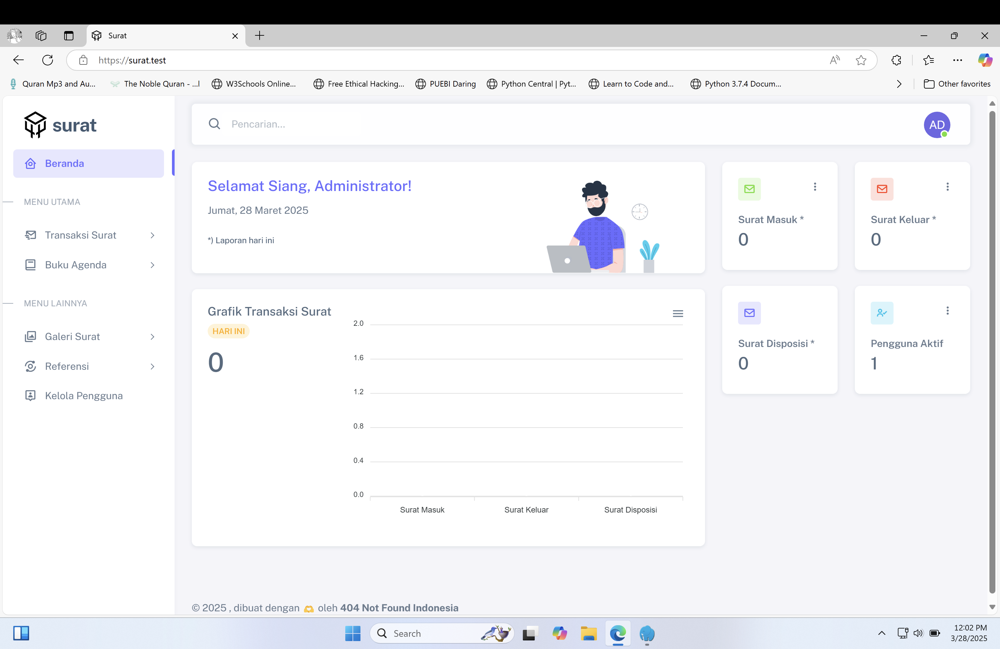
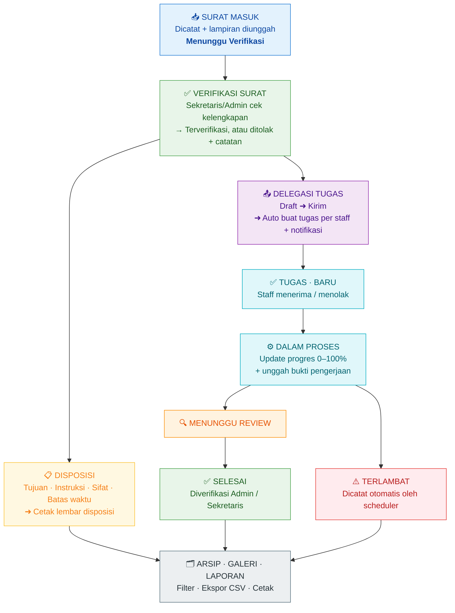
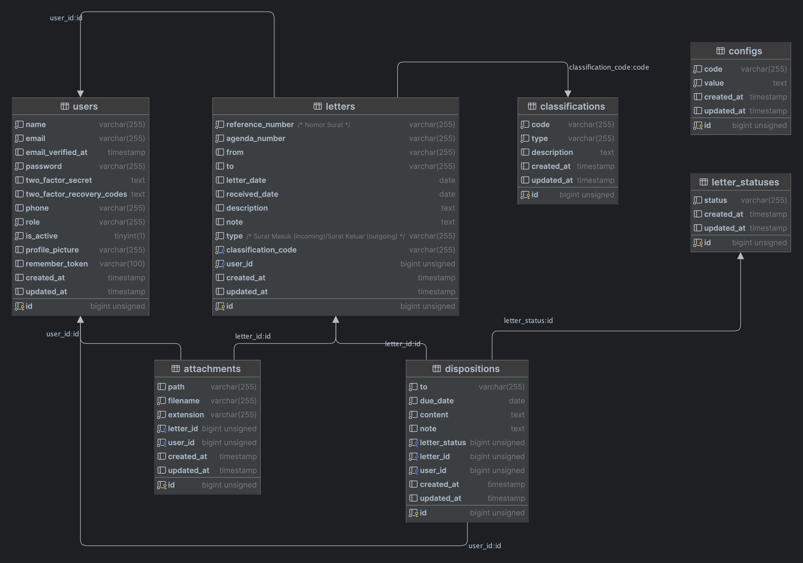

<div align="center">


# 📬 E-DELEGASI

### *Sistem Informasi Surat Masuk, Surat Keluar & Delegasi Tugas Aparat*

**Dari kertas yang menumpuk menjadi digital yang bisa dipantau.**

[](https://github.com/Dikrey)
[](https://github.com/Dikrey)
[](https://tiktok.com/@raihan_official0307)

[](https://github.com/Dikrey/e-delegasi)
[](https://github.com/Dikrey/e-delegasi/stargazers)
[](https://github.com/Dikrey/e-delegasi/network/members)
[](https://github.com/Dikrey/e-delegasi/issues)
[](LICENSE)

[](https://laravel.com)
[](https://www.php.net)
[](https://www.mysql.com)
[](https://getbootstrap.com)
[](https://vitejs.dev)
[](#-lisensi-dan-kredit)

</div>

---

## 📌 Tentang Aplikasi

**E-DELEGASI** (*Electronic Digital Delegation and Staff Task Information System*) adalah aplikasi web
yang lahir untuk menjawab satu masalah klasik instansi: **surat menumpuk, tugas tercecer, dan
tidak ada yang tahu pekerjaan sudah sampai mana.**

Berawal dari aplikasi pengelolaan surat sederhana, E-DELEGASI dikembangkan menjadi sistem
terintegrasi yang menyatukan siklus penuh administrasi kantor:

```
📥 SURAT MASUK  ➜  ✅ VERIFIKASI  ➜  📋 DISPOSISI  ➜  📤 DELEGASI  ➜  ✅ TUGAS  ➜  📊 LAPORAN
```

> ### 🎓 Project Akhir — Muhammad Raihan
>
> Aplikasi ini merupakan **Project Akhir (Tugas Akhir)** yang dikembangkan sendiri oleh
> **Muhammad Raihan**.
>
> Repository ini adalah hasil dari project tersebut, dan
> **kredit nama pembuat wajib dicantumkan**.
> Rincian lengkap ada di bagian [Lisensi](#-lisensi-dan-kredit).

---

## 📸 Preview

<div align="center">
  
</div>

<div align="center">
  <em>Tampilan antarmuka utama E-DELEGASI — dashboard, surat, disposisi, delegasi, dan tugas.</em>
</div>

---

## 🧭 Daftar Isi

| # | Bagian | |
|:-:|:--|:--|
| 01 | [Tentang Aplikasi](#-tentang-aplikasi) | Ringkasan & tujuan |
| 02 | [Fitur Lengkap](#-fitur-lengkap) | Semua modul aplikasi |
| 03 | [Peran Pengguna](#-peran-pengguna) | Pembagian hak akses |
| 04 | [Tech Stack](#-tech-stack) | Teknologi yang digunakan |
| 05 | [Alur Kerja](#-alur-kerja) | Cara kerja aplikasi |
| 06 | [Database](#-database) | Skema & struktur data |
| 07 | [Instalasi](#-instalasi) | Cara menjalankan |
| 08 | [Konfigurasi](#-konfigurasi) | Pengaturan lanjutan |
| 09 | [Testing](#-testing) | Menjalankan pengujian |
| 10 | [Dokumentasi](#-dokumentasi) | Dokumen pendukung |
| 11 | [Kontributor](#-kontributor--credit) | Credit & acknowledgment |
| 12 | [Lisensi](#-lisensi-dan-kredit) | Ketentuan penggunaan |

---

## ✨ Fitur Lengkap

E-DELEGASI dibangun dengan **13 modul utama** yang saling terhubung. Berikut rinciannya.

---

### 🔐 1. Autentikasi & Keamanan

Sistem autentikasi ditulis khusus (bukan default Laravel) dengan lapisan keamanan berlapis:

- **Login & logout** dengan proteksi **rate limiting** (mencegah brute-force)
- **3 level hak akses** — `admin`, `sekretaris`, `staff`
- **Blokir akun nonaktif** — pengguna yang dinonaktifkan langsung diarahkan ke halaman *blocked*
- **Manajemen perangkat aktif** — lihat perangkat yang sedang login, **logout satu perangkat** atau **logout semua perangkat lain**
- **Pencabutan sesi otomatis** saat kata sandi diubah atau akun dinonaktifkan
- **Sesi tervalidasi** — `session.valid` middleware memvalidasi sesi pada setiap request
- **Security headers** — `X-Frame-Options`, `X-Content-Type-Options`, `Referrer-Policy`, `Permissions-Policy`
- **Catatan aktivitas (Activity Log)** — seluruh aktivitas pengguna tercatat untuk audit *(khusus admin)*

---

### 📊 2. Dashboard Cerdas

Dashboard **otomatis menyesuaikan peran** pengguna yang login:

| Peran | Dashboard |
|:--|:--|
| **Admin** | Ringkasan penuh, grafik, kalender agenda |
| **Sekretaris** | Fokus verifikasi, disposisi, delegasi, monitoring |
| **Staff** | Fokus tugas, progres, dan tenggat |

- Statistik surat masuk, keluar, disposisi, delegasi, dan tugas
- **Persentase kenaikan/penurunan** dibandingkan hari ini & kemarin
- Grafik **mingguan** (bar chart) & **komposisi hari ini** (donut chart)
- **Kalender agenda** langsung di dashboard
- **3D animated background** (three.js) untuk tampilan premium
- Sapaan personal sesuai waktu (*pagi / siang / sore / malam*)

---

### 📥 3. Manajemen Surat Masuk

- **CRUD lengkap** — tambah, edit, hapus, lihat detail
- Pencarian cepat: pengirim, nomor surat, nomor agenda, perihal
- **Unggah & kelola lampiran** (PDF/gambar)
- **Sistem verifikasi 2 tahap** — `Menunggu Verifikasi` ➜ `Terverifikasi`
- Catatan verifikasi & penolakan bila berkas tidak lengkap
- **7 status verifikasi** lengkap dengan label & warna badge
- Agenda surat masuk + **cetak A4 landscape**

---

### 📤 4. Manajemen Surat Keluar

- **CRUD lengkap** dengan pencarian & lampiran
- **Alur draft ➜ final** — surat keluar berstatus `waiting_for_final_file` sampai berkas
  final (tanda tangan) diunggah, baru menjadi `final`
- Nomor agenda otomatis dengan **validasi nomor unik**
- Agenda surat keluar + **cetak A4 landscape**

---

### 📋 5. Disposisi Surat

- Buat, edit, hapus disposisi per surat
- **Penentuan tujuan**, instruksi, sifat disposisi, dan batas waktu
- **Lembar disposisi siap cetak** — format resmi berkop instansi
- Field lanjutan: diteruskan ke, penghormatan, arah (direction), tanggal diterima
- **Verifikasi disposisi** oleh sekretaris/admin
- Rekam jejak siapa & kapan yang memverifikasi

---

### 📤 6. E-Delegasi — Modul Inti ⚡

> Fitur **ter Andal** dan pembeda utama aplikasi ini.

- **Buat delegasi langsung dari surat** yang sudah terverifikasi
- Keterangan, instruksi, **kategori tugas**, prioritas, dan batas waktu (deadline)
- **Pilih banyak staff sekaligus** dalam satu delegasi
- **Kirim delegasi** ➜ sistem otomatis membuat **Tugas untuk setiap staff** + kirim **Notifikasi**
- **Re-delegasi** — meneruskan delegasi yang sama ke staff lain
- **Monitoring board** — pantau seluruh delegasi aktif
- **Sinkronisasi status otomatis** — status delegasi mengikuti progres tugas-tugas di dalamnya
- Surat otomatis berstatus *didelegasikan* / *selesai* mengikuti progres delegasi

---

### ✅ 7. Manajemen Tugas

- **Papan Kanban** dengan **drag & drop** antar kolom status
- **Terima / Tolak** tugas beserta alasan
- **Update progres 0–100%** dengan slider
- **Catatan pengerjaan** pada setiap update
- **Unggah bukti pengerjaan** (PDF/DOC/DOCX/PNG/JPG, maks. **10 MB**)
- **Riwayat progres** lengkap per tugas
- **Ajukan Review** otomatis saat progres mencapai 100%
- **Verifikasi hasil kerja** oleh admin/sekretaris — diterima atau dikembalikan
- **Unduh bukti** hasil kerja & lampiran setiap update
- 7 status tugas dengan label & badge otomatis

---

### 📅 8. Agenda Pimpinan

- **Kalender interaktif** (FullCalendar) — seluruh agenda dalam satu tampilan
- Tab **Hari Ini / Mendatang / Selesai**
- CRUD agenda lengkap dengan tautan ke delegasi
- **Reschedule** langsung dari kalender *(drag & drop)*
- Ubah status: `Terjadwal` ➜ `Selesai` / `Dibatalkan`
- Lokasi, jam mulai–selesai, dan catatan agenda

---

### 🗂️ 9. Arsip & Galeri

- **Arsip gabungan** surat masuk & keluar dengan filter jenis & rentang tanggal
- **Ekspor arsip** ke CSV
- **Galeri surat** — seluruh lampiran ditampilkan sebagai kartu grid (Masonry)
- Lampiran yang **tersedia untuk dilihat & diunduh**

---

### 🗃️ 10. Referensi / Master Data *(khusus Admin)*

- **Klasifikasi Surat** — kode, jenis, keterangan
- **Status Surat** — sifat surat
- **Departemen / Unit Kerja** — dengan jumlah pengguna
- **Kategori Tugas** — dengan warna & jumlah tugas
- Seluruh master data mendukung CRUD

---

### 🔔 11. Notifikasi

- Notifikasi **event-driven** (real-time, tanpa refresh) via AJAX polling
- Event yang memicu notifikasi: delegasi baru, tugas diterima/ditolak, progres
  diunggah, tugas menunggu review, tugas selesai, **tenggat mendekati**, tugas terlambat
- Tanda belum dibaca + **tandai semua sudah dibaca**
- Hapus notifikasi

---

### 📈 12. Laporan & Ekspor

- **Laporan Delegasi**, **Laporan Tugas**, **Laporan Agenda**
- Filter berdasarkan rentang tanggal, status, dan prioritas
- Ringkasan jumlah & persentase
- **Ekspor CSV dengan UTF-8 BOM** — langsung rapi dibuka di Microsoft Excel
- Tampilan siap cetak (`@media print`)

---

### ⚙️ 13. Pengaturan Sistem & Profil

**Profil (semua pengguna)**
- Ubah nama, email, nomor telepon
- Ganti foto profil
- Lihat daftar perangkat aktif
- Nonaktifkan akun sendiri *(khusus staff)*

**Pengaturan Sistem (khusus admin)**
- Nama aplikasi & nama instansi
- Alamat, telepon, email instansi
- Nama penanggung jawab (PIC)
- Jumlah data per halaman
- Kata sandi bawaan pengguna baru

---

## 👥 Peran Pengguna

| Kemampuan | 👑 Admin | 🗂️ sekretaris | 👤 Staff |
|:--|:--:|:--:|:--:|
| Dashboard penuh + grafik | ✅ | ✅ | ✅ *(ringkas)* |
| Surat Masuk (CRUD) | ✅ | ✅ | ➖ |
| Surat Keluar (CRUD) | ✅ | ✅ | ➖ |
| **Verifikasi Surat** | ✅ | ✅ | ❌ |
| Disposisi | ✅ | ✅ | ➖ |
| **Verifikasi Disposisi** | ✅ | ✅ | ❌ |
| **Delegasi Tugas** | ✅ | ✅ | ❌ |
| Monitoring Delegasi | ✅ | ✅ | ➖ |
| **Kerjakan Tugas** | ➖ | ➖ | ✅ |
| **Verifikasi Hasil Tugas** | ✅ | ✅ | ❌ |
| Agenda Pimpinan | ✅ | ✅ | ✅ *(lihat)* |
| Arsip & Galeri | ✅ | ✅ | ✅ |
| Laporan & Ekspor CSV | ✅ | ✅ | ➖ |
| Referensi / Master Data | ✅ | ❌ | ❌ |
| Kelola Pengguna | ✅ | ❌ | ❌ |
| Riwayat Aktivitas | ✅ | ❌ | ❌ |
| Pengaturan Sistem | ✅ | ❌ | ❌ |

> ✅ = Akses penuh &nbsp;&nbsp; ➖ = Tidak tersedia di menu &nbsp;&nbsp; ❌ = Ditolak (`403 Forbidden`)

---

## 🛠️ Tech Stack

<table>
<tr>
<td valign="top" width="50%">

### **Backend**

| Teknologi | Peran |
|:--|:--|
| **Laravel 9.x** | Framework utama (MVC, routing, DI) |
| **PHP 8.0+** | Bahasa pemrograman |
| **Eloquent ORM** | Layer database & relasi |
| **Laravel Fortify** | Fondasi auth (routes dimatikan, dipakai custom) |
| **Laravel Sanctum** | Token API |
| **Laravel Tinker** | REPL artisan |
| **Laravel Scheduler** | Background job otomatis |
| **Guzzle HTTP** | Deteksi lokasi perangkat (ip-api.com) |
| **PHP 8.1 Enums** | Status, prioritas, peran, config |

</td>
<td valign="top" width="50%">

### **Frontend & Library**

| Teknologi | Peran |
|:--|:--|
| **Blade** | Template engine |
| **Bootstrap 5** | Framework UI + paginasi |
| **Sneat** | Template admin premium |
| **jQuery** | Interaksi DOM |
| **ApexCharts** | Bar chart & donut chart |
| **FullCalendar 5** | Kalender agenda |
| **SweetAlert2** | Dialog konfirmasi & notifikasi |
| **Masonry** | Grid galeri lampiran |
| **Perfect Scrollbar** | Scrollbar sidebar |
| **Boxicons** | Ikon |
| **three.js** | Latar 3D animasi |
| **Public Sans** | Typography (Google Fonts) |

</td>
</tr>
<tr>
<td valign="top" width="50%">

### **Database & DevOps**

| Teknologi | Peran |
|:--|:--|
| **MySQL 8** | Database (utf8mb4) |
| **Vite 3** | Asset bundler |
| **laravel-vite-plugin** | Integrasi Vite ↔ Laravel |
| **PostCSS** | Preprocessor CSS |
| **Axios** | HTTP client |
| **Lodash** | Utility JavaScript |
| **Composer** | Dependency manager |
| **Nginx / Apache** | Web server produksi |
| **Laragon / XAMPP** | Environment pengembangan |

</td>
<td valign="top" width="50%">

### **Kualitas & Workflow**

| Teknologi | Peran |
|:--|:--|
| **PHPUnit 9** | Automated testing |
| **Laravel Pint** | Formatter PHP |
| **Spatie Ignition** | Debugger |
| **Mockery / Faker** | Mocking & data dummy |
| **Makefile** | Otomasi setup |
| **Artisan Command** | CLI pengingat & sinkron status tugas |

</td>
</tr>
</table>

---

## 🔄 Alur Kerja




**Ringkasan Alur Status**

```
SURAT MASUK   Menunggu Verifikasi ➜ Terverifikasi ➜ Disposisi / Delegasi / Arsip

TUGAS         Baru ➜ Diterima / Ditolak ➜ Dalam Pengerjaan
              ➜ (100%) Menunggu Review ➜ [Verifikasi] ➜ Selesai
              ⚠️ Tidak selesai tepat waktu ➜ Terlambat

DELEGASI      Draft ➜ Aktif ➜ Selesai / Terlambat  (mengikuti status tugas di dalamnya)

AGENDA        Terjadwal ➜ Selesai / Dibatalkan  (bisa di-reschedule dari kalender)
```

---

## 🗄️ Database

**19 tabel** dengan relasi lengkap dan foreign key yang konsisten.

| Kategori | Tabel |
|:--|:--|
| **Inti** | `users`, `letters`, `dispositions`, `attachments` |
| **Delegasi & Tugas** | `delegations`, `tasks`, `task_updates` |
| **Pendukung** | `agendas`, `notifications`, `activity_logs`, `login_sessions` |
| **Master Data** | `classifications`, `letter_statuses`, `departments`, `task_categories` |
| **Sistem** | `configs` |
| **Framework** | `password_resets`, `failed_jobs`, `personal_access_tokens` |

<div align="center">
  
</div>

- 📄 **Skema lengkap** — [docs/database_schema.png](docs/database_schema.png)
- 📦 **SQL Dump** — [docs/surat.sql](docs/surat.sql) *(siap import)*
- 📊 **Analisis ERD & integritas** — [docs/ERD-STRUKTUR-DATABASE.md](docs/ERD-STRUKTUR-DATABASE.md)

---

## ⚡ Instalasi

### 📋 Persyaratan

| Kebutuhan | Versi |
|:--|:--|
| **PHP** | `> 8.0.2` *(direkomendasikan 8.1+)* |
| **Composer** | `2.x` |
| **MySQL** | `5.7+` / `8.x` |
| **Node.js** | `16+` *(opsional, untuk asset)* |

Ekstensi PHP wajib: `pdo_mysql`, `mbstring`, `openssl`, `tokenizer`, `xml`, `ctype`, `json`, `fileinfo`, `bcmath`

---

### 🚀 Cara 1 — Otomatis dengan Makefile *(Paling Gampang)*

```bash
# 1. Clone repository
git clone https://github.com/Dikrey/e-delegasi.git
cd e-delegasi
```

> Ganti URL di atas dengan nama repository Anda jika Anda membuat fork.

```bash
# 2. Setup aplikasi (install dependency, .env, key, storage link)
make setup

# 3. Siapkan database (migrate + seeder user & config)
make setup-db

# 4. Opsional — isi data dummy untuk demo
make setup-dummy

# 5. Jalankan aplikasi
make run
```

> Akses di **http://127.0.0.1:8000**

---

### 🛠️ Cara 2 — Manual

**1. Clone & install dependency**

```bash
git clone https://github.com/Dikrey/e-delegasi.git
cd e-delegasi
composer install
```

**2. Siapkan konfigurasi**

```bash
cp .env.example .env        # Linux / macOS
copy .env.example .env      # Windows CMD
```

**3. Sesuaikan database di `.env`**

```env
DB_CONNECTION=mysql
DB_HOST=127.0.0.1
DB_PORT=3306
DB_DATABASE=surat
DB_USERNAME=root
DB_PASSWORD=
```

Buat dulu database `surat` di MySQL/phpMyAdmin.

**4. Generate application key**

```bash
php artisan key:generate
```

**5. Link storage**

```bash
php artisan storage:link
```

**6. Migrasi & seed database**

```bash
php artisan migrate
php artisan db:seed --class=UserSeeder
php artisan db:seed --class=ConfigSeeder
```

**7. (Opsional) Data dummy — 50 surat, disposisi, delegasi, tugas, notifikasi, agenda**

```bash
php artisan migrate:fresh --seed
```

**8. Jalankan**

```bash
php artisan serve
```

---

### 🔑 Akun Bawaan

| Peran | Surel | Kata Sandi |
|:--|:--|:--|
| 👑 Administrator | `admin@admin.com` | `admin` |
| 🗂️ Sekretaris | `sekretaris@admin.com` | `sekretaris` |
| 👤 Staff | `staff@admin.com` | `staff` |
| 👤 Staff | `siti@admin.com` | `staff` |
| 👤 Staff | `andi@admin.com` | `staff` |
| 👤 Staff | `dewi@admin.com` | `staff` |

> ⚠️ **Segera ganti kata sandi bawaan** sebelum dipakai di lingkungan produksi.

---

## ⚙️ Konfigurasi

### 🌍 Bahasa (Dual Language)

Aplikasi mendukung **Bahasa Indonesia** & **Bahasa Inggris**.

```php
// config/app.php
'locale' => 'id',        // 'id' = Indonesia, 'en' = English
'fallback_locale' => 'en',
```

Seluruh teks antarmuka sudah diterjemahkan di folder `resources/lang/{id,en}`.

---

### ⏰ Zona Waktu

```php
// config/app.php
'timezone' => 'Asia/Makassar',
```

Daftar lengkap zona waktu PHP tersedia di [PHP Timezones](https://www.php.net/manual/en/timezones.php).

---

### ⏱️ Scheduler *(WAJIB di Produksi)*

Aplikasi memakai **Laravel Scheduler** untuk:

- Menandai tugas yang **terlambat** otomatis
- Mengirim notifikasi **tenggat mendekati** (≤ 3 hari)
- Mengirim notifikasi **agenda hari ini**

Tambahkan cron job ini di server:

```bash
* * * * * cd /path/ke/e-delegasi && php artisan schedule:run >> /dev/null 2>&1
```

Atau jalankan manual:

```bash
php artisan delegasi:refresh-status
```

---

### 💾 Penyimpanan File

| Jenis File | Lokasi |
|:--|:--|
| Lampiran surat | `public/attachments` |
| Bukti pengerjaan tugas | `public/task-documents` |
| Lampiran delegasi | `public/{folder dinamis}` |
| Foto profil | `public/profile` |

> Pastikan `php artisan storage:link` sudah dijalankan dan folder storage
> memiliki izin tulis (`chmod -R 775 storage`).

---

### 🔐 Keamanan Produksi

```bash
php artisan config:cache      # cache konfigurasi
php artisan route:cache       # cache routing
php artisan view:cache        # cache view
```

- Arahkan `APP_DEBUG=false` pada `.env` produksi
- Gunakan HTTPS
- Pastikan `config/cors.php` tidak memakai `allowed_origins => ['*']` di produksi

---

## 🧪 Testing

Proyek ini dilengkapi **15 test otomatis** yang memverifikasi alur autentikasi,
manajemen sesi perangkat, alur disposisi, dan kontrol hak akses.

```bash
# Jalankan seluruh test
php artisan test

# Atau dengan PHPUnit
vendor/bin/phpunit
```

> **Catatan:** Test berjalan pada database MySQL nyata di dalam transaksi
> (`DatabaseTransactions`) dan dikonfigurasi pada `phpunit.xml`.

---

## 📚 Dokumentasi

| Dokumen | Isi |
|:--|:--|
| 📖 [docs/SETUP.md](docs/SETUP.md) | Panduan instalasi lengkap (Windows/Linux/VPS/Shared Hosting) |
| 📖 [ALUR-KERJA.md](ALUR-KERJA.md) | Manual alur kerja aplikasi dari sudut pandang pengguna |
| 📊 [docs/ERD-STRUKTUR-DATABASE.md](docs/ERD-STRUKTUR-DATABASE.md) | Analisis struktur database, relasi, & temuan integritas |
| 🎓 [docs/LAPORAN-PKL-E-DELEGASI.md](docs/LAPORAN-PKL-E-DELEGASI.md) | Laporan Project Akhir (PKL) — analisis, desain, UML, ERD, pengujian |
| 💾 [docs/surat.sql](docs/surat.sql) | SQL Dump siap import |
| 🖼️ [docs/database_schema.png](docs/database_schema.png) | Diagram skema database |

---

## 👨‍💻 Kontributor & Credit

<table>
<tr>
<td align="center" width="50%">

### 🙏 **Pembuat & Penulis Kode**

<a href="https://github.com/Dikrey" target="_blank">
  
</a>

## **Muhammad Raihan**

**Project Akhir (Tugas Akhir) — E-DELEGASI**

[](https://github.com/Dikrey)
[](https://tiktok.com/@raihan_official0307)

📧 Email · 💼 LinkedIn · 🎬 YouTube

</td>
<td align="center" width="50%">

### 🤝 **Ucapan Terima Kasih Kepada**

| Pihak | Kontribusi |
|:--|:--|
| [**Laravel**](https://laravel.com) | Framework pengembangan |
| [**Sneat**](https://github.com/themeselection/sneat-html-admin-template-free) | Template admin |
| [**Bootstrap**](https://getbootstrap.com) | Framework UI |
| [**FullCalendar**](https://fullcalendar.io) | Komponen kalender |
| [**ApexCharts**](https://apexcharts.com) | Library grafik |
| [**SweetAlert2**](https://sweetalert2.github.io) | Dialog interaktif |
| [**three.js**](https://threejs.org) | Animasi latar 3D |
| [**404 Not Found Indonesia**](https://404notfound.fun) | Bahan awal & template |

</td>
</tr>
</table>

---

## 📜 Lisensi dan Kredit

Aplikasi ini dilisensikan di bawah **[MIT License](LICENSE)**.

<div align="center">

**Copyright © Muhammad Raihan**

[](https://github.com/Dikrey)
[](https://tiktok.com/@raihan_official0307)

</div>

### 🎓 Tentang Project Akhir

> **E-DELEGASI** adalah **Project Akhir (Tugas Akhir)** yang dikerjakan sendiri oleh
> **Muhammad Raihan** — mencakup proses analisis sistem, perancangan database,
> pembuatan antarmuka, sampai implementasi dan pengujian aplikasi.

### ⚠️ Ketentuan Penggunaan

Aplikasi ini **gratis dan terbuka** untuk digunakan, dipelajari, dan dikembangkan —
baik untuk keperluan pribadi, akademik, maupun komersial. **Dengan syarat mutlak:**

1. **Kredit WAJIB DICANTUMKAN.**
   Credit berikut **tidak boleh dihapus, diubah, disamarkan, atau diganti** oleh siapa pun:

   > **Dibuat oleh: Muhammad Raihan — Project Akhir (Tugas Akhir)**
   > Repository: **github.com/Dikrey/e-delegasi**
   > GitHub: **github.com/Dikrey**
   > TikTok: **tiktok.com/@raihan_official0307**

2. **Credit harus terlihat.**
   Credit wajib ditampilkan di **`README.md`**, halaman *Tentang / About* aplikasi,
   serta di bagian kredit pada dokumentasi atau publikasi apa pun yang memakai
   aplikasi ini.

3. **Dilarang menghapus credit.**
   Menghapus, mengaburkan, mengganti nama, atau memalsukan identitas pembuat
   merupakan **pelanggaran lisensi** dan **tidak diperbolehkan** dalam bentuk apa pun,
   termasuk pada fork, modifikasi, distribusi ulang, maupun versi turunan.

4. **Lisensi tetap.**
   Derivasi dari proyek ini harus tetap memakai lisensi MIT dan tetap mencantumkan
   credit asli di atas.

5. **Tanpa representations.**
   Proyek ini disediakan *"dengan cara apa adanya"* — **tanpa jaminan** apa pun
   (lihat bagian `DISCLAIMER` pada [LICENSE](LICENSE)).

> 💡 **Intinya sederhana:** pakai, pakai gotong royong, Contribute — asal **jangan dihapus credit yang ada.**

---

## ⭐ Credit Wajib

```
+--------------------------------------------------+
|                                                  |
|   Dibuat oleh: Muhammad Raihan                   |
|   Project Akhir (Tugas Akhir)                    |
|                                                  |
|   Repo   : github.com/Dikrey/e-delegasi          |
|   GitHub : github.com/Dikrey                     |
|   TikTok : tiktok.com/@raihan_official0307       |
|                                                  |
|   Mohon JANGAN menghapus credit ini.             |
|                                                  |
+--------------------------------------------------+
```

Tempelkan blok di atas di **semua** versi, fork, dan distribusi ulang aplikasi ini.
Kredit ini adalah **bagian tak terpisahkan** dari lisensi proyek.

---

<div align="center">

### 📬 Mari Terhubung

[](https://github.com/Dikrey/e-delegasi)
[](https://github.com/Dikrey)
[](https://tiktok.com/@raihan_official0307)
[](mailto:github.com/Dikrey)

---

**Dibuat dengan 💜 oleh Muhammad Raihan**
*Project Akhir — E-DELEGASI © 2026*

[](https://github.com/Dikrey/e-delegasi)
[](https://github.com/Dikrey/e-delegasi/fork)

`⭐ Jangan lupa beri bintang jika aplikasinya membantu!`

</div>
