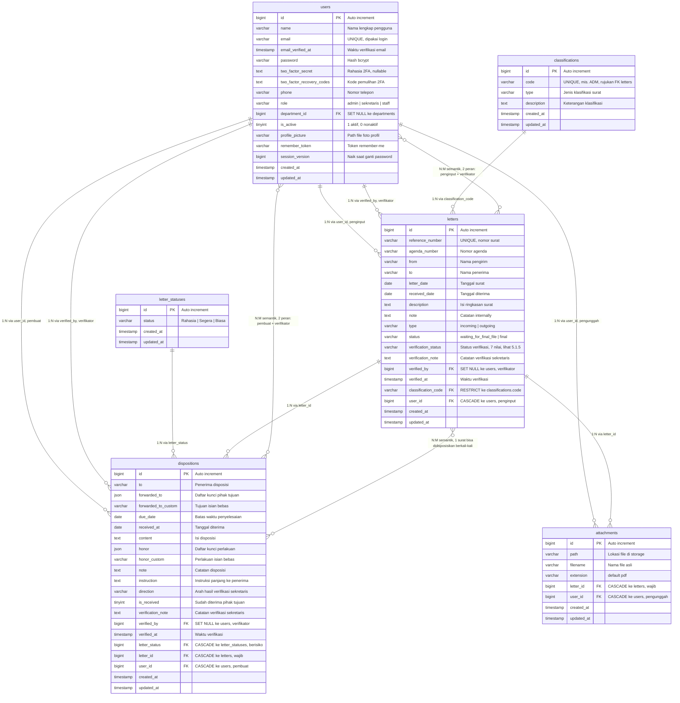
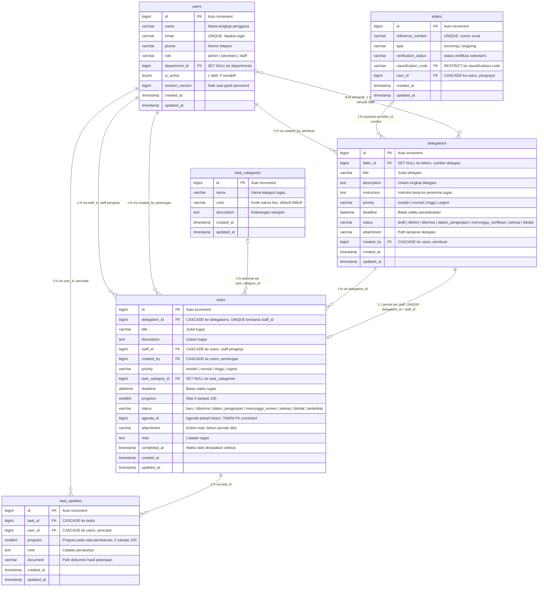
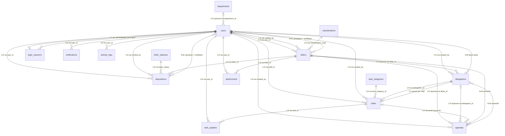
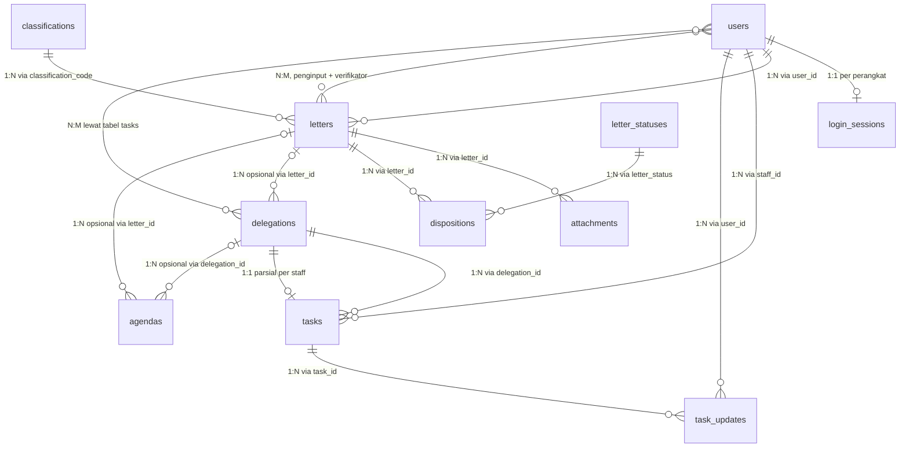
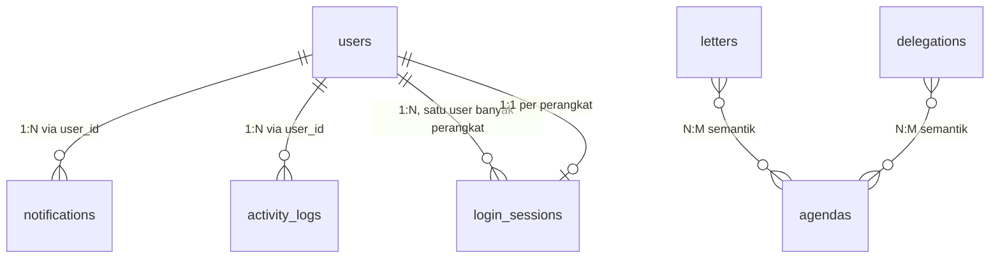
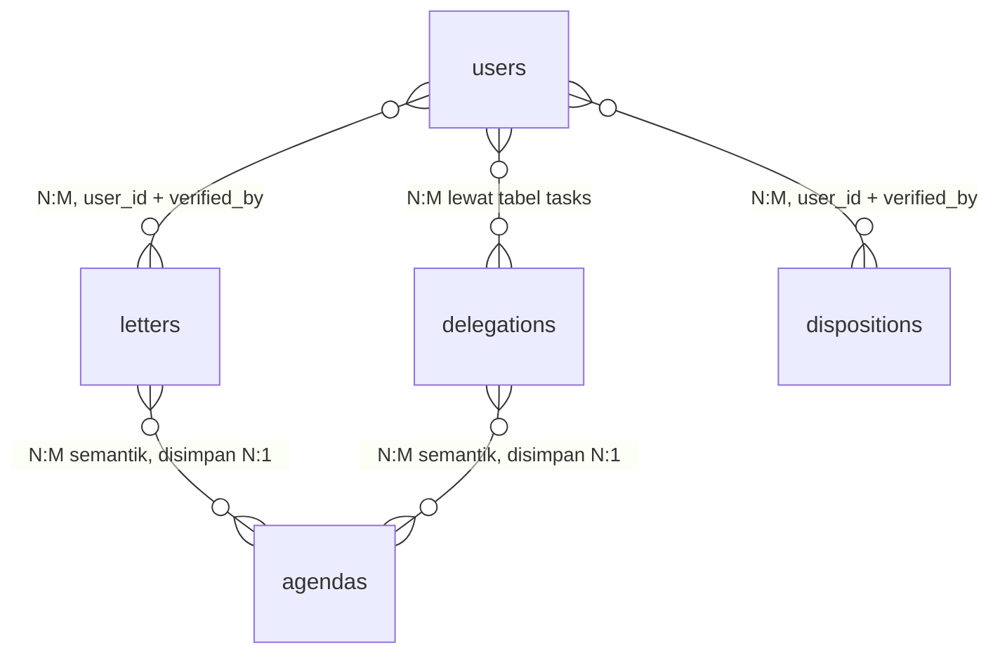
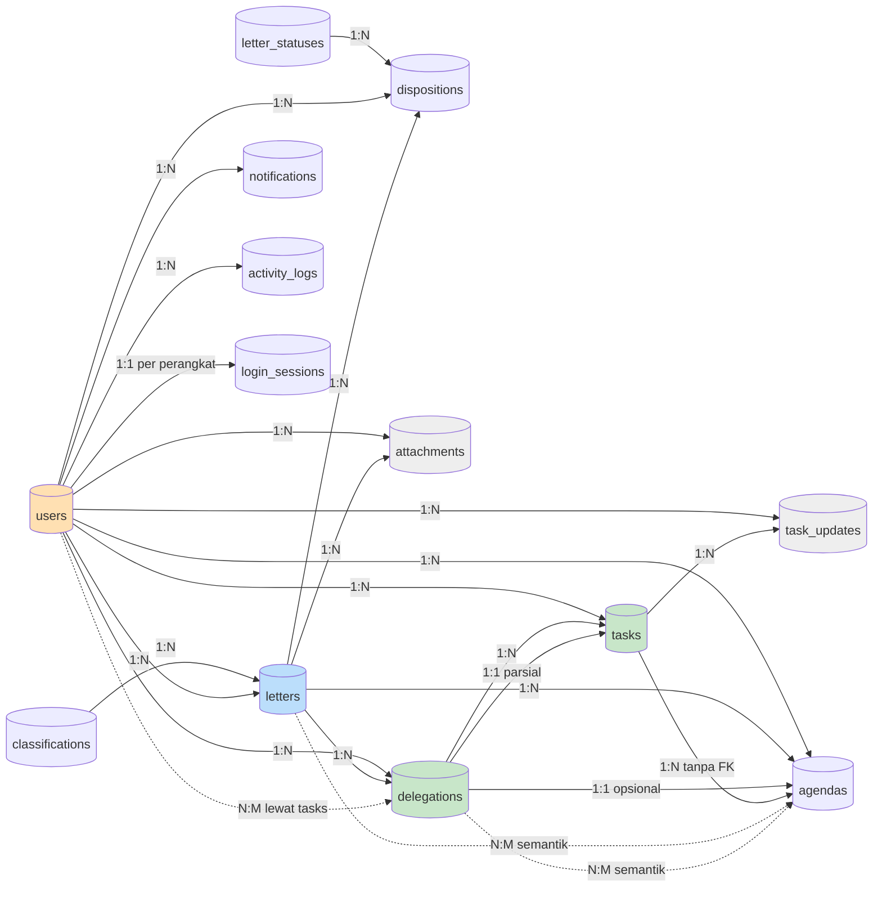

# Analisis Struktur Database & ERD — Aplikasi E-Delegasi

> **Sistem:** E-Delegasi (*Electronic Digital Delegation and Staff Task Information System*)
> **Basis data:** MySQL 8.0.30 / InnoDB / `utf8mb4_unicode_ci` — database `surat`
> **Framework:** Laravel (Eloquent ORM) — sumber kebenaran: `surat.sql`, `database/migrations/`, `app/Models/`
> **Tanggal analisis:** 26 September 2026

---

## DAFTAR ISI

1. [Ringkasan Eksekutif](#1-ringkasan-eksekutif)
2. [Dasar Teori Relasi Tabel](#2-dasar-teori-relasi-tabel)
3. [Klasifikasi Tabel](#3-klasifikasi-tabel)
4. [Analisis Tabel yang Dapat Dihapus](#4-analisis-tabel-yang-dapat-dihapus)
5. [ERD Tabel Utama](#5-erd-tabel-utama) — termasuk klasifikasi relasi 1:1, 1:N, dan N:M
6. [Relasi Antar Tabel Lengkap](#6-relasi-antar-tabel-lengkap)
7. [Kolom Orphan & Temuan Integritas](#7-kolom-orphan--temuan-integritas)
8. [Rekomendasi Efisiensi](#8-rekomendasi-efisiensi)
9. [Checklist Penghapusan](#9-checklist-penghapusan)

---

## 1. Ringkasan Eksekutif

Database `surat` berisi **20 tabel**. Setelah ditelusuri seluruh `app/`, `database/`, `resources/views/`, `routes/`, dan `tests/`, diperoleh kesimpulan:

| Kategori | Jumlah | Tabel |
|---|---|---|
| **Wajib ada (core)** | 8 | `users`, `letters`, `dispositions`, `attachments`, `delegations`, `tasks`, `task_updates`, `agendas` |
| **Master data (wajib ada)** | 4 | `classifications`, `letter_statuses`, `configs`, `login_sessions` |
| **Pendukung / fitur)** | 2 | `notifications`, `activity_logs` |
| **Boleh dihapus** | 1 | `departments` *(dengan syarat: hapus sebagai paket lengkap)* |
| **Hanya bermigrasi (jangan dihapus)** | 4 | `migrations`, `failed_jobs`, `password_resets`, `personal_access_tokens` |
| **Sudah dihapus sebelumnya** | 1 | `nomor_surat_requests` *(migration `2026_09_19_000001`)* |

### Empat Temuan Utama

1. **Seluruh relasi bertipe 1:N secara fisik.** Database ini memiliki **24 foreign key constraint** (20 FK inti + 4 FK dari tabel master) ditambah 1 kolom logis tanpa constraint (`tasks.agenda_id`) = **25 relasi 1:N**. Tidak ada satu pun tabel perantara murni.
2. **Tidak ada relasi One-to-One (1:1) murni.** Yang paling mendekati adalah `login_sessions` ↔ `users` (1:1 per perangkat sesi), `delegations` ↔ `tasks` (1:1 per pasangan delegasi–staff, dijaga `UNIQUE(delegation_id, staff_id)`), dan `delegations` ↔ `agendas` (1:1 opsional).
3. **Ada 5 relasi Many-to-Many (N:M) semantik, tetapi tidak ada N:M murni.** Relasi `delegations` ↔ `staff`, `letters`/`dispositions` ↔ `users`, dan `letters`/`delegations` ↔ `agendas` secara logika N:M, namun seluruhnya direpresentasikan sebagai 1:N di skema fisik melalui tabel perantara `tasks`, dua FK ke tabel yang sama (`user_id` + `verified_by`), atau kolom tunggal. Ketiga jenis relasi **1:1, 1:N, dan N:M** dilabeli eksplisit pada setiap garis di ERD — lihat [Sub-bab 5.1.0](#510-legenda--konvensi) dan [Sub-bab 5.1.8](#518-klasifikasi-lengkap-relasi-11-1n-dan-nm).
4. **Menghapus tabel TIDAK akan meningkatkan efisiensi.** Tabel InnoDB yang kosong hanya menempati ±8–12 KB di `ibdatafile` dan tidak menambah waktu query. Kapasitas query ditentukan oleh **index, jumlah baris, dan caching**, bukan keberadaan tabel. Rekomendasi efisiensi yang benar ada di [Bagian 8](#8-rekomendasi-efisiensi).

### Jawaban atas Dugaan: Tabel `departments`

**Ya, tabel `departments` tidak diperlukan dan aman dihapus.** Detail dan alasannya di [Sub-bab 4.1](#41-kandidat-1-departments--dapat-dihapus).

Bukti pendukung:

| Bukti | Nilai |
|---|---|
| Jumlah baris `departments` | **0** (kosong total) |
| Seeder `DepartmentSeeder` | **Tidak ada** di `database/seeders/` |
| Kolom `users.department_id` terisi | **0 dari 6 user** (semua `NULL`) |
| Rujukan fitur lain | **Tidak ada** — `departments` tidak terhubung ke `letters`, `delegations`, `tasks`, maupun `agendas` |

Tabel `departments` adalah fitur "Data Unit/Bagian" yang UI-nya sudah jadi lengkap, tetapi belum pernah diisi data dan belum pernah dipakai untuk membagi tugas. Statusnya **"scaffolding / belum diimplementasikan"**, bukan "dipakai".

---

## 2. Dasar Teori Relasi Tabel

### 2.1 One to One (1:1)

Satu entitas berhubungan dengan **tepat satu** entitas lainnya. Contoh: satu	user memiliki **satu** profil pada tabel `users`.

- **Kunci pembeda:** kedua tabel harus memiliki *candidate key* yang sama (misalnya `email`).
- **Bentuk fisik di MySQL:** kolom `UNIQUE` pada tabel anak, atau kedua tabel berbagi *primary key* yang sama.
- **Di sistem ini:** **tidak ada 1:1 murni.** Yang paling mendekati adalah `login_sessions` — satu baris `login_sessions` hanya mewakili satu `session_id` milik satu `user_id`, sehingga satu baris sesi terikat 1:1 dengan satu pengguna pada perangkat tersebut.

### 2.2 One to Many (1:N)

Satu entitas mempunyai **banyak** entitas lain, tetapi setiap entitas anak hanya memiliki **satu** induk. Ini adalah relasi yang paling umum di database relasional.

- **Kunci pembeda:** tabel induk `1`, tabel anak `N`.
- **Bentuk fisik di MySQL:** *foreign key* pada tabel anak, dengan *primary key* induk menjadi rujukan.
- **Contoh di sistem ini:** 1 `letters` → N `dispositions`; 1 `delegations` → N `tasks`; 1 `users` → N `login_sessions`.
- **Aturan penghapusan penting:**
  - `ON DELETE CASCADE` — hapus induk **ikut menghapus** anak. Contoh: hapus `letters` → semua `dispositions` ikut terhapus.
  - `ON DELETE SET NULL` — hapus induk, kolom FK anak menjadi `NULL`. Contoh: hapus `users` → `activity_logs.user_id` jadi `NULL` (log tetap tersimpan).
  - `ON DELETE RESTRICT` (default) — hapus induk **ditolak** selama masih ada anak. Contoh: hapus `classifications` yang dipakai surat → ditolak MySQL.

### 2.3 Many to Many (N:M)

Banyak entitas A berhubungan dengan banyak entitas B, dan sebaliknya. Contoh: banyak siswa mengikuti banyak mata pelajaran, dan banyak mata pelajaran diikuti banyak siswa.

- **Masalah:** tidak bisa diwujudkan langsung di MySQL, karena *primary key* hanya mengizinkan satu nilai unik per kolom.
- **Solusi:** buat **tabel perantara** (*junction* / *associative* / *pivot* table) yang memuat `id` dari kedua tabel.

```sql
CREATE TABLE enrollments (
    id          BIGINT UNSIGNED AUTO_INCREMENT PRIMARY KEY,
    student_id  BIGINT UNSIGNED NOT NULL,   -- FK -> students.id
    subject_id  BIGINT UNSIGNED NOT NULL,   -- FK -> subjects.id
    score       DECIMAL(5,2)  NULL,
    enrolled_at DATE         NOT NULL,
    UNIQUE (student_id, subject_id)          -- mencegah data ganda
);
```

Relasi `students` ↔ `subjects` berubah dari N:M menjadi **1:N** dua arah melalui `enrollments`.

- **Di sistem ini:** **tidak ada tabel perantara murni.** Namun ada **dua pola mendekati N:M** yang sudah berjalan:

**Pola A — Tabel perantara yang membawa data (mirip N:M):**

```
users (staff)  ──< tasks >──  delegations  ──< letters
      N                 M          1              1
```

Satu `delegations` dapat ditugaskan ke banyak *staff*, dan satu *staff* dapat menerima banyak `delegasi`. Secara logika relasinya **N:M** antara `users` dan `delegations`, yang diselesaikan oleh tabel `tasks` sebagai penghubung. Bedanya dengan *pivot* klasik: `tasks` bukan tabel perantara kosong, melainkan membawa payload nyata (`title`, `status`, `progress`, `deadline`, `priority`). Pola ini lazim disebut **junction table with payload** atau *associative entity*.

**Pola B — Dua foreign key ke tabel yang sama (implisit N:M):**

Beberapa tabel memegang **dua kolom FK** yang sama-sama menunjuk ke `users.id`, karena satu entitas berinteraksi dengan user dalam **dua peran berbeda**:

| Tabel | Kolom peran 1 | Kolom peran 2 |
|---|---|---|
| `letters` | `user_id` (pembuat/penginput) | `verified_by` (verifikator sekretaris) |
| `dispositions` | `user_id` (pembuat) | `verified_by` (verifikator sekretaris) |

Karena user yang sama bisa menjadi pembuat sekaligus verifikator pada banyak surat, relasi `users` ↔ `letters` secara semantik adalah **N:M**, diekspresikan melalui dua FK terpisah. Pendekatan ini **sah secara normalisasi** (setara *role relationship* pada model UML).

---

## 3. Klasifikasi Tabel

### 3.1 Tabel Inti (Wajib Ada, 8 Tabel)

| Tabel | Fungsi | Baris | Ancestor |
|---|---|---|---|
| `users` | Data pengguna & autentikasi | 6 | — |
| `letters` | Surat masuk & surat keluar | 50 | — |
| `dispositions` | Hasil disposisi surat | 15 | `letters` |
| `attachments` | Lampiran berkas surat | 0 | `letters` |
| `delegations` | Data delegasi tugas | 8 | `letters` |
| `tasks` | Tugas hasil delegasi | 15 | `delegations` |
| `task_updates` | Riwayat progres tugas | 10 | `tasks` |
| `agendas` | Agenda pimpinan | 4 | — |

### 3.2 Tabel Master & Konfigurasi (Wajib Ada, 4 Tabel)

| Tabel | Fungsi | Baris | Ancestor |
|---|---|---|---|
| `classifications` | Klasifikasi surat (ADM) | 1 | — |
| `letter_statuses` | Sifat surat (Rahasia/Segera/Biasa) | 3 | — |
| `configs` | Konfigurasi sistem & identitas instansi | 9 | — |
| `login_sessions` | Sesi login & perangkat aktif | 1 | `users` |

### 3.3 Tabel Pendukung (2 Tabel)

| Tabel | Fungsi | Baris | Ancestor |
|---|---|---|---|
| `notifications` | Notifikasi in-app | 13 | `users` |
| `activity_logs` | Jejak audit aktivitas | 7 | `users` |

### 3.4 Tabel Teknis / Kerangka Kerja (4 Tabel — JANGAN DIHAPUS)

| Tabel | Fungsi | Baris | Ancestor |
|---|---|---|---|
| `migrations` | State migration Laravel | 28 | — |
| `failed_jobs` | Antrean job gagal | 0 | — |
| `password_resets` | Reset kata sandi | 0 | — |
| `personal_access_tokens` | Token API (Sanctum) | 0 | — |

### 3.5 Tabel Kandidat Penghapusan (1 Tabel)

| Tabel | Fungsi | Baris | Ancestor |
|---|---|---|---|
| `departments` | Data unit/bagian organisasi | **0** | — |

---

## 4. Analisis Tabel yang Dapat Dihapus

### 4.1 Kandidat 1: `departments` — DAPAT DIHAPUS ✅

#### Bukti Ke-Hollow-an

```
surat.sql:251-252   INSERT INTO `departments` ...   → TIDAK ADA (tabel kosong)
surat.sql:710       users → semua department_id = NULL
database/seeders/   → tidak ada DepartmentSeeder
```

Relasi `departments` hanya terhubung ke `users`, dan **`users.department_id` selalu `NULL`**. Tabel ini tidak pernah participate dalam satu pun query business logic (tidak ada filter laporan, pengelompokan tugas, atau routing surat berdasarkan unit).

#### Yang Rusak Jika Dihapus (13 titik)

Penghapusan harus dilakukan **sebagai satu paket**, karena MySQL menolak `DROP TABLE` selama constraint masih ada.

| # | Lokasi | File:Line | Yang Rusak |
|---|---|---|---|
| 1 | Constraint DB | `users_department_id_foreign` | `DROP TABLE` ditolak MySQL |
| 2 | Model | `app/Models/User.php:30` | `'department_id'` ada di `$fillable` |
| 3 | Model | `app/Models/User.php:107-109` | Relasi `department()` tidak terdefinisi |
| 4 | Model | `app/Models/Department.php:23` | Relasi `users()` + `withCount('users')` error |
| 5 | Validasi | `app/Http/Requests/StoreUserRequest.php:52` | `exists:departments,id` menolak semua create user |
| 6 | Validasi | `app/Http/Requests/UpdateUserRequest.php:52` | Idem, untuk update user |
| 7 | Controller | `app/Http/Controllers/UserController.php:28,48,84` | Query `Department::orderBy('name')` untuk dropdown |
| 8 | Controller | `app/Http/Controllers/DepartmentController.php` (seluruh file) | 500 — semua method |
| 9 | View | `pages/user.blade.php:88-89,102,133,172-176,229-233` | Kolom & `<select>` unit/bagian |
| 10 | View | `pages/reference/department.blade.php` (seluruh file) | 500 — halaman master |
| 11 | View | `components/sidebar.blade.php:247-249` | Menu masih tampil, klik → 500 |
| 12 | Route | `routes/web.php:102` | 5 route resource |
| 13 | Bahasa | `lang/{id,en}/model.php:86`, `lang/{id,en}/menu.php:90,94` | Teks menu mengambang |

#### Dampak Data

**Nol.** Tabel kosong, seluruh `department_id` bernilai `NULL`, tidak ada seeder. Tidak ada data historis yang hilang.

#### Dampak Logika

**Tidak ada logika bisnis yang hilang.** Fitur "Data Unit/Bagian" memang **sudah ada UI-nya tetapi belum pernah diimplementasikan** (tidak ada data, tidak ada aturan yang memakainya). Menghapusnya sama dengan menghapus fitur yang belum pernah hidup — bukan mengurangi logika yang berjalan.

#### Rekomendasi

**Dihapus**, dengan konsekuensi berikut harus diterima:

- Kolom "Unit/Bagian" hilang dari halaman **Manajemen Pengguna** (`pages/user.blade.php`).
- Menu **Referensi → Data Unit/Bagian** hilang dari sidebar.
- Jika nantinya butuh pengelompokan tugas per unit, perlu dibuat ulang — namun butuh **revisi skema**: `tasks` perlu FK `department_id`, dan laporan perlu filter baru. Karena tabel masih kosong, **momen menghapus sekarang adalah yang termurah**.

---

### 4.2 Kandidat 2: `task_categories` — SEBAIKNYA DISIMPAN ⚠️

`surat.sql:669` — hanya **1 dari 15 task** yang memakai `task_category_id = 1`. Master ini juga masih terisi 1 baris (`administrasi`) dan **sudah dipakai** di dropdown form delegasi (`pages/delegation/create.blade.php:68`), filter task (`pages/task/index.blade.php:55`), dan laporan (`ReportController.php:183,208`).

Berbeda dengan `departments`, tabel ini **sudah digunakan** sehingga menghapusanya akan mengurangi satu dimensi klasifikasi tugas yang sudah tampil di UI.

**Rekomendasi: SIMPAN.** Nullisitas tinggi (14 dari 15 `NULL`) adalah wajar — kategori bersifat opsional. Biayanya hanya 1 baris data.

---

### 4.3 Tabel Kosong yang HARUS TETAP ADA

Lima tabel kosong di database tetap wajib dipertahankan karena sudah **terpasang pada kode yang berjalan**:

| Tabel | Mengapa Tidak Boleh Dihapus |
|---|---|
| `attachments` | `ON DELETE CASCADE` dari `letters`; dipakai upload di form surat masuk/keluar, 2 galeri, export arsip, dan guard finalisasi surat keluar (`OutgoingLetterController.php:192`) |
| `personal_access_tokens` | `routes/api.php:17` memakai `auth:sanctum`; trait `HasApiTokens` terpasang di `app/Models/User.php:13` |
| `login_sessions` | `EnsureActiveSession` middleware memaksa logout bila baris tidak ada → menghapus = **mengunci semua user keluar aplikasi** |
| `password_resets` | `config/auth.php:18,89` masih menunjuk ke broker ini; `Fortify::ignoreRoutes()` severed, `ResetUserPassword` masih ada |
| `failed_jobs` | `config/queue.php` default; tabel standar untuk `php artisan queue:failed` |

---

## 5. ERD Tabel Utama

> Mermaid `erDiagram`. Notasi: `||` = tepat satu, `o{` = nol atau banyak, `}o--o{` = banyak ke banyak.
>
> **Sub-bab 5.1 memuat isi lengkap setiap tabel** (nama kolom, tipe, kunci PK/FK, keterangan, domain nilai, dan contoh data). Sub-bab 5.2 dan 5.3 adalah versi ringkas yang hanya menampilkan relasi.

### 5.1 ERD Inti — Modul Surat, Delegasi, dan Tugas

> **ERD di bawah ini sudah memuat ISI LENGKAP setiap tabel** — bukan hanya nama tabelnya. Setiap entity ditulis dengan seluruh kolom, tipe data, kunci (PK/FK), dan keterangan singkat per kolom. Sumber: `surat.sql` (baris `CREATE TABLE`).

#### 5.1.0 Legenda & Konvensi

**Tiga jenis relasi yang dipakai pada ERD ini:**

| Jenis Relasi | Notasi Mermaid | Arti | Jumlah pada DB ini |
|---|---|---|---|
| **One-to-One (1:1)** | `\|\|--o\|` | Satu induk ↔ maksimal satu anak | **0 relasi 1:1 murni** — 3 kandidat terdekat |
| **One-to-Many (1:N)** | `\|\|--o{` atau `\|o--o{` | Satu induk → banyak anak | **24 FK fisik** = 20 FK inti + 4 FK master (mayoritas struktur) |
| **Many-to-Many (N:M)** | `}o--o{` | Banyak induk ↔ banyak anak | **0 relasi N:M murni** — 5 relasi N:M **semantik** via tabel perantara / FK ganda |

| Simbol | Arti |
|---|---|
| `PK` | Primary Key |
| `FK` | Foreign Key |
| `\|\|--o{` | Exactly satu ke banyak (**1:N**) |
| `\|o--o{` | Nol atau satu ke banyak (**1:N opsional**) |
| `\|\|--o\|` | Exactly satu ke maksimal satu (**1:1**) |
| `\|o--o\|` | Nol atau satu ke maksimal satu (**1:1 opsional**) |
| `}o--o{` | Banyak ke banyak (**N:M**) |
| `CASCADE` | Hapus induk → anak ikut terhapus |
| `SET NULL` | Hapus induk → FK anak jadi `NULL` |
| `RESTRICT` | Hapus induk ditolak selama masih ada anak |
| ⚠️ | Temuan integritas (lihat Bagian 7) |

> **Setiap garis relasi pada diagram diberi label cardinality-nya** (`1:N`, `1:1`, `N:M`) agar jenis relasinya langsung terlihat tanpa perlu mencocokkan notasi.

Semua tabel memakai `ENGINE=InnoDB`, `utf8mb4` / `utf8mb4_unicode_ci`, `bigint unsigned AUTO_INCREMENT` sebagai PK, dan kolom `created_at` + `updated_at` (`timestamp NULL`) sebagai audit waktu.

> **Catatan tipe data:** Mermaid `erDiagram` tidak menerima tanda kurung pada nama tipe, sehingga tipe ditulis dalam bentuk singkat. Pemetaan ke tipe MySQL sebenarnya:
>
> | Tipe di ERD | Tipe MySQL sebenarnya |
> |---|---|
> | `bigint` | `bigint unsigned` (PK & FK) |
> | `smallint` | `smallint unsigned` (`progress`) |
> | `tinyint` | `tinyint(1)` (`is_active`, `is_received`, `is_read`) |
> | `varchar` | `varchar(255)` (atau `varchar(100)` untuk `remember_token`, `varchar(64)` untuk `login_sessions.session_id`, `varchar(50)` untuk device/browser/platform) |
> | `text` | `text` |
> | `json` | `json` (`forwarded_to`, `honor`) |
> | `date` | `date` |
> | `datetime` | `datetime` |
> | `time` | `time` |
> | `timestamp` | `timestamp NULL` |

---

#### 5.1.1 Modul Surat — `letters`, `dispositions`, `attachments` + Master



**Ringkasan jenis relasi pada modul surat:**

| Relasi | Jenis | Teknik Penyimpanan | Catatan |
|---|---|---|---|
| `users` → `letters` (`user_id`) | **1:N** | FK langsung | Relasi fisik 1:N |
| `users` → `letters` (`verified_by`) | **1:N** | FK langsung | FK kedua ke tabel yang sama |
| `users` ↔ `letters` (gabungan kedua FK) | **N:M** | Dua FK terpisah | Satu user bisa jadi penginput *dan* verifikator pada surat berbeda |
| `users` ↔ `dispositions` (`user_id` + `verified_by`) | **N:M** | Dua FK terpisah | Pola identik dengan `letters` |
| `classifications` → `letters` | **1:N** | FK ke `classifications.code` | `ON DELETE RESTRICT` |
| `letter_statuses` → `dispositions` | **1:N** | FK langsung | ⚠️ `ON DELETE CASCADE` |
| `letters` → `dispositions` | **1:N** | FK langsung | `ON DELETE CASCADE` |
| `letters` → `attachments` | **1:N** | FK langsung | `ON DELETE CASCADE` |
| *letters* ↔ *dispositions* (semantik) | **N:M** | Disimpan secara fisik sebagai 1:N | Secara fisik ada di `dispositions.letter_id` — satu surat memang boleh didisposisikan lebih dari satu kali |

> **Tidak ada relasi 1:1 pada modul surat.** Semua relasi di sini either 1:N (fisik) atau N:M semantik. Kandidat 1:1 terdekat ada di modul pendukung (`users` ↔ `login_sessions`) dan modul delegasi (`delegations` ↔ `tasks`) — lihat Sub-bab 5.1.8.

**Ringkasan isi tabel modul surat:**

| Tabel | Jumlah kolom | Isi / Fungsi |
|---|---|---|
| `letters` | 18 | Induk data surat masuk & surat keluar: nomor surat (unik), nomor agenda, pengirim, penerima, tanggal surat, tanggal diterima, isi, catatan, tipe surat, status arsip, status & catatan verifikasi sekretaris, verifikator, kode klasifikasi, serta penginput |
| `dispositions` | 20 | Hasil disposition surat: penerima, tujuan (JSON + isian bebas), tenggat, tanggal diterima, isi disposisi, perlakuan (JSON + isian bebas), catatan, instruksi, arah, flag sudah diterima, catatan verifikasi, verifikator, sifat surat, surat asal, dan pembuat |
| `attachments` | 8 | Lampiran berkas surat: path penyimpanan, nama file, ekstensi, surat pemilik, dan pengunggah |
| `classifications` | 6 | Master klasifikasi surat: kode (unik, mis. `ADM`), jenis, dan keterangan |
| `letter_statuses` | 4 | Master sifat surat: `Rahasia`, `Segera`, `Biasa` |

---

#### 5.1.2 Modul Delegasi & Tugas — `delegations`, `tasks`, `task_updates`



**Ringkasan jenis relasi pada modul delegasi & tugas:**

| Relasi | Jenis | Teknik Penyimpanan | Catatan |
|---|---|---|---|
| `users` → `delegations` (`created_by`) | **1:N** | FK langsung | Satu admin/sekretaris membuat banyak delegasi |
| `users` → `tasks` (`staff_id`) | **1:N** | FK langsung | Satu staff menerima banyak tugas |
| `users` → `tasks` (`created_by`) | **1:N** | FK langsung | Satu penetugas membuat banyak tugas |
| `users` → `task_updates` (`user_id`) | **1:N** | FK langsung | Satu pencatat menulis banyak progres |
| `letters` → `delegations` (`letter_id`) | **1:N opsional** | FK langsung, `SET NULL` | Satu surat bisa didelegasikan ke banyak kali |
| `task_categories` → `tasks` | **1:N opsional** | FK langsung, `SET NULL` | Kategori bersifat opsional |
| `delegations` → `tasks` | **1:N** | FK langsung, `CASCADE` | Satu delegasi dipecah jadi banyak task per staff |
| `tasks` → `task_updates` | **1:N** | FK langsung, `CASCADE` | Satu task punya banyak update progres |
| **`users` (staff) ↔ `delegations`** | **N:M** | **Tabel perantara `tasks`** | Relasi logik N:M — 1 delegasi → banyak staff, 1 staff → banyak delegasi. Diteknik dengan *junction table with payload* |
| **`delegations` ↔ `tasks` (per staff)** | **1:1 parsial** | **`UNIQUE (delegation_id, staff_id)`** | Setiap pasangan delegasi–staff hanya boleh punya 1 task |

> **Penting — `tasks` adalah junction table dengan payload.** Relasi `users` (staff) ↔ `delegations` secara logika adalah **N:M**, yang diselesaikan oleh `tasks` sebagai tabel penghubung. Bedanya dengan *pivot* klasik: `tasks` bukan tabel perantara kosong, melainkan membawa payload nyata (`title`, `status`, `progress`, `deadline`, `priority`, `note`). Pola ini lazim disebut **junction table with payload** atau *associative entity*. Batas `UNIQUE (delegation_id, staff_id)` menjadikan relasi per-pasangan tersebut **1:1**.

**Ringkasan isi tabel modul delegasi & tugas:**

| Tabel | Jumlah kolom | Isi / Fungsi |
|---|---|---|
| `delegations` | 12 | Header delegasi: surat asal, judul, uraian, instruksi kerja, prioritas, tenggat, status alur (7 tahap), lampiran, dan pembuat |
| `tasks` | 17 | Satu baris = satu tugas milik satu staff dari satu delegasi: delegasi asal, judul, uraian, staff pengerja, penetugas, prioritas, kategori, tenggat, progres (0–100), status (7 tahap), backlink agenda, lampiran, catatan, dan waktu selesai |
| `task_updates` | 8 | Riwayat progres tugas: tugas terkait, pencatat, snapshot progres, catatan, dan path dokumen hasil pekerjaan |
| `task_categories` | 6 | Master kategori tugas: nama, warna, keterangan |

> **Penting — `tasks` adalah junction table dengan payload.** Satu `delegations` dapat ditugaskan ke banyak staff, dan satu staff dapat menerima banyak delegasi. Relasi logis `delegations` ↔ `staff` sebenarnya N:M, dan diselesaikan oleh `tasks`. Batas `UNIQUE (delegation_id, staff_id)` memastikan satu staff hanya memiliki **satu** task per delegasi.

---

#### 5.1.3 Modul Agenda, Sesi, Notifikasi & Audit

```mermaid
erDiagram
    users {
        bigint id PK "Auto increment"
        varchar name "Nama lengkap pengguna"
        varchar email "UNIQUE, dipakai login"
        varchar role "admin | sekretaris | staff"
        tinyint is_active "1 aktif, 0 nonaktif"
        bigint session_version "Naik saat ganti password"
        timestamp created_at
        timestamp updated_at
    }

    letters {
        bigint id PK "Auto increment"
        varchar reference_number "UNIQUE, nomor surat"
        varchar type "incoming | outgoing"
        timestamp created_at
        timestamp updated_at
    }

    delegations {
        bigint id PK "Auto increment"
        bigint letter_id FK "SET NULL ke letters"
        varchar title "Judul delegasi"
        varchar priority "rendah | normal | tinggi | urgent"
        varchar status "draft | dikirim | diterima | dalam_pengerjaan | menunggu_verifikasi | selesai | ditolak"
        datetime deadline
        bigint created_by FK "CASCADE ke users"
        timestamp created_at
        timestamp updated_at
    }

    tasks {
        bigint id PK "Auto increment"
        bigint delegation_id FK "CASCADE ke delegations"
        bigint staff_id FK "CASCADE ke users, pengerja"
        smallint progress "0 sampai 100"
        varchar status "baru | diterima | dalam_pengerjaan | menunggu_review | selesai | ditolak | terlambat"
        bigint agenda_id "Backlink agenda, tanpa FK"
        timestamp completed_at
        timestamp created_at
        timestamp updated_at
    }

    agendas {
        bigint id PK "Auto increment"
        varchar title "Judul agenda"
        text description "Uraian agenda"
        varchar agenda_type "rapat | undangan | kunjungan | audiensi | pelatihan | lainnya"
        bigint delegation_id FK "SET NULL ke delegations"
        bigint letter_id FK "SET NULL ke letters"
        date date "Tanggal agenda"
        time start_time "Jam mulai"
        time end_time "Jam selesai"
        varchar location "Lokasi"
        varchar status "terjadwal | selesai | dibatalkan"
        bigint created_by FK "CASCADE ke users, pembuat"
        text note "Catatan"
        timestamp created_at
        timestamp updated_at
    }

    login_sessions {
        bigint id PK "Auto increment"
        bigint user_id FK "CASCADE ke users"
        varchar session_id "ID sesi Laravel, varchar 64"
        varchar ip_address "IP perangkat"
        text user_agent "User agent browser"
        varchar device "Komputer | HP | Tablet"
        varchar browser "Chrome, Firefox, dan lain-lain"
        varchar platform "Windows, Android, dan lain-lain"
        varchar location "Label lokasi jaringan"
        timestamp last_activity_at "Aktivitas terakhir"
        timestamp created_at
        timestamp updated_at
    }

    notifications {
        bigint id PK "Auto increment"
        bigint user_id FK "CASCADE ke users, penerima"
        varchar type "delegation | task | deadline | agenda | system"
        varchar title "Judul notifikasi"
        text message "Isi pesan"
        varchar link "URL tujuan, mis. http localhost task 1"
        tinyint is_read "0 belum dibaca, 1 sudah dibaca"
        timestamp read_at "Waktu ditandai dibaca"
        timestamp created_at
        timestamp updated_at
    }

    activity_logs {
        bigint id PK "Auto increment"
        bigint user_id FK "SET NULL ke users, pelaku"
        varchar action "Keterangan aksi"
        varchar module "task | delegation | letter, dan lain-lain"
        bigint reference_id "ID referensi polimorfis, tanpa FK"
        varchar ip_address "IP pelaku"
        text payload "JSON ringkas perubahan"
        timestamp created_at
        timestamp updated_at
    }

    users ||--o{ agendas : "1:N via created_by, pembuat"
    users ||--o| login_sessions : "1:1 per perangkat, satu sesi satu user"
    users ||--o{ login_sessions : "1:N, satu user banyak perangkat"
    users ||--o{ notifications : "1:N via user_id, penerima"
    users ||--o{ activity_logs : "1:N via user_id, pelaku"
    letters |o--o{ agendas : "1:N opsional via letter_id"
    delegations |o--o{ agendas : "1:N opsional via delegation_id"
    tasks |o--o{ agendas : "1:N semantik via agenda_id, TANPA FK"

    letters }o--o{ agendas : "N:M semantik, disimpan sebagai N:1"
    delegations }o--o{ agendas : "N:M semantik, disimpan sebagai N:1"
    delegations ||--o| agendas : "1:1 opsional, agenda tindak lanjut delegasi"
```



**Ringkasan jenis relasi pada modul pendukung:**

| Relasi | Jenis | Teknik Penyimpanan | Catatan |
|---|---|---|---|
| `users` → `agendas` (`created_by`) | **1:N** | FK langsung | Satu user membuat banyak agenda |
| **`users` ↔ `login_sessions` (per sesi/perangkat)** | **1:1** | **FK + `UNIQUE` semantik** | **Kandidat 1:1 terdekat di database ini.** Satu baris `login_sessions` hanya mewakili satu `session_id` milik satu `user_id` |
| `users` → `login_sessions` | **1:N** | FK langsung, `CASCADE` | Satu user boleh login dari banyak perangkat sekaligus |
| `users` → `notifications` | **1:N** | FK langsung, `CASCADE` | Lonceng notifikasi |
| `users` → `activity_logs` | **1:N** | FK langsung, `SET NULL` | Log tetap tersimpan meski user dihapus |
| `letters` → `agendas` (`letter_id`) | **1:N opsional** | FK langsung, `SET NULL` | Secara semantik bisa N:M |
| `delegations` → `agendas` (`delegation_id`) | **1:N opsional** | FK langsung, `SET NULL` | `DelegationSeeder` membuat 1 agenda per delegasi |
| **`delegations` ↔ `agendas` (per delegasi)** | **1:1 opsional** | 1 agenda tindak lanjut per delegasi | `DelegationSeeder` membuat tepat 1 agenda untuk setiap delegasi |
| `tasks` ↔ `agendas` (`tasks.agenda_id`) | **1:N semantik** | ⚠️ **tanpa FK constraint** | Backlink historis — lihat Bagian 7.2 |
| *letters* ↔ *agendas* | **N:M** | Disimpan sebagai N:1 | Secara fisik ada di `agendas.letter_id` |
| *delegations* ↔ *agendas* | **N:M** | Disimpan sebagai N:1 | Secara fisik ada di `agendas.delegation_id` |

**Ringkasan isi tabel modul pendukung:**

| Tabel | Jumlah kolom | Isi / Fungsi |
|---|---|---|
| `agendas` | 15 | Agenda pimpinan: judul, uraian, jenis agenda, delegasi & surat asal, tanggal, jam mulai–selesai, lokasi, status, pembuat, catatan |
| `login_sessions` | 12 | Sesi login & perangkat aktif: user, ID sesi, IP, user agent, jenis perangkat, browser, platform, lokasi jaringan, dan aktivitas terakhir |
| `notifications` | 10 | Notifikasi in-app: penerima, jenis, judul, pesan, link tujuan, flag & waktu baca |
| `activity_logs` | 9 | Jejak audit: pelaku, aksi, modul, ID referensi, IP, dan payload JSON perubahan |

---

#### 5.1.4 Daftar Kolom & Kunci Panjang per Tabel

| Tabel | PK | Kolom UNIQUE | Kolom FK | ON DELETE FK | Index Penting |
|---|---|---|---|---|---|
| `users` | `id` | `email` | `department_id` → `departments.id` | SET NULL | `users_email_unique` |
| `letters` | `id` | `reference_number` | `classification_code` → `classifications.code`<br>`user_id` → `users.id`<br>`verified_by` → `users.id` | RESTRICT<br>CASCADE<br>SET NULL | 3 index FK |
| `dispositions` | `id` | — | `letter_id` → `letters.id`<br>`user_id` → `users.id`<br>`verified_by` → `users.id`<br>`letter_status` → `letter_statuses.id` | CASCADE<br>CASCADE<br>SET NULL<br>**CASCADE** ⚠️ | 4 index FK |
| `attachments` | `id` | — | `letter_id` → `letters.id`<br>`user_id` → `users.id` | CASCADE<br>CASCADE | 2 index FK |
| `delegations` | `id` | — | `letter_id` → `letters.id`<br>`created_by` → `users.id` | SET NULL<br>CASCADE | `status_deadline`, `priority` |
| `tasks` | `id` | `(delegation_id, staff_id)` ⚠️ | `delegation_id` → `delegations.id`<br>`staff_id` → `users.id`<br>`created_by` → `users.id`<br>`task_category_id` → `task_categories.id` | CASCADE<br>CASCADE<br>CASCADE<br>SET NULL | `status_staff_id`, `deadline_progress` |
| `task_updates` | `id` | — | `task_id` → `tasks.id`<br>`user_id` → `users.id` | CASCADE<br>CASCADE | `task_id_created_at` |
| `agendas` | `id` | — | `delegation_id` → `delegations.id`<br>`letter_id` → `letters.id`<br>`created_by` → `users.id` | SET NULL<br>SET NULL<br>CASCADE | `date_status`, `agenda_type` |
| `classifications` | `id` | `code` | — | — | `classifications_code_unique` |
| `letter_statuses` | `id` | — | — | — | — |
| `task_categories` | `id` | — | — | — | — |
| `login_sessions` | `id` | — | `user_id` → `users.id` | CASCADE | `user_id_session_id`, `session_id` |
| `notifications` | `id` | — | `user_id` → `users.id` | CASCADE | `user_id_is_read` |
| `activity_logs` | `id` | — | `user_id` → `users.id` | SET NULL | `user_id_created_at`, `module` |

**Kolom yang tidak punya relasi FK:**

| Tabel | Kolom | Status |
|---|---|---|
| `tasks` | `agenda_id` | Aktif di kode (`DelegationController.php:164`, `Task::agenda()`) tetapi **tanpa** `CONSTRAINT` → perlu index (Bagian 8.2) |
| `activity_logs` | `reference_id` | Polymorphic-like, menunjuk `tasks.id` atau `delegations.id` sesuai `module` — sengaja tanpa FK |
| `letters` | `note`, `status`, `verification_note` | Kolom bebas (TEXT / varchar) tanpa referensi |

---

#### 5.1.5 Domain Nilai Kolom Penting (Enum di Level Aplikasi)

Nilai-nilai ini **tidak** ditegakkan oleh MySQL (tidak ada `ENUM`/`CHECK`) — semuanya divalidasi di level Laravel, dan sebagian besar sudah diwakili oleh PHP enum di `app/Enums/`.

| Tabel | Kolom | Nilai yang Diizinkan | Default | Sumber enum |
|---|---|---|---|---|
| `users` | `role` | `admin`, `sekretaris`, `staff` | `staff` | `App\Enums\Role` |
| `users` | `is_active` | `1` (aktif), `0` (nonaktif) | `1` | — |
| `letters` | `type` | `incoming` (surat masuk), `outgoing` (surat keluar) | `incoming` | `App\Enums\LetterType` |
| `letters` | `status` | `waiting_for_final_file`, `final` | `NULL` | `App\Enums\LetterStatus` |
| `letters` | `verification_status` | `menunggu_verifikasi`, `terverifikasi`, `tidak_memerlukan_tindak_lanjut`, `memerlukan_tindak_lanjut`, `didelegasikan`, `selesai`, `diarsipkan` | `menunggu_verifikasi` | `App\Enums\LetterVerification` |
| `dispositions` | `is_received` | `1` (sudah diterima), `0`/NULL (belum) | `NULL` | — |
| `delegations` | `priority` | `rendah`, `normal`, `tinggi`, `urgent` | `normal` | `App\Enums\Priority` |
| `delegations` | `status` | `draft`, `dikirim`, `diterima`, `dalam_pengerjaan`, `menunggu_verifikasi`, `selesai`, `ditolak` | `draft` | `App\Enums\DelegationStatus` |
| `tasks` | `priority` | `rendah`, `normal`, `tinggi`, `urgent` | `normal` | `App\Enums\Priority` |
| `tasks` | `status` | `baru`, `diterima`, `dalam_pengerjaan`, `menunggu_review`, `selesai`, `ditolak`, `terlambat` | `baru` | `App\Enums\TaskStatus` |
| `tasks` | `progress` | `0` – `100` | `0` | — |
| `task_updates` | `progress` | `0` – `100` (`smallint unsigned`) | `0` | — |
| `agendas` | `agenda_type` | `rapat`, `undangan`, `kunjungan`, `audiensi`, `pelatihan`, `lainnya` | `NULL` | kolom `COMMENT` di `surat.sql:63` |
| `agendas` | `status` | `terjadwal`, `selesai`, `dibatalkan` | `terjadwal` | `App\Enums\AgendaStatus` |
| `letter_statuses` | `status` | `Rahasia`, `Segera`, `Biasa` (diisi lewat master) | — | data master |
| `notifications` | `type` | `delegation`, `task`, `deadline`, `agenda`, `system` | `system` | kolom `COMMENT` di `surat.sql:481` |
| `notifications` | `is_read` | `0` (belum), `1` (sudah) | `0` | — |
| `activity_logs` | `module` | `task`, `delegation`, `letter`, dan lain-lain (bebas) | `NULL` | — |

> **Catatan:** kolom `status` pada `letters` **berbeda makna** dari `status` pada `delegations`/`tasks`/`agendas`. Pada `letters` ia menyatakan status arsip (`waiting_for_final_file` = masih menunggu berkas final, `final` = sudah final), sedangkan pada tabel lain ia menyatakan tahap alur kerja. Jangan disamakan saat membuat laporan.

---

#### 5.1.6 Contoh Isi Tabel (Cuplikan dari `surat.sql`)

| Tabel | Baris | Contoh Isi |
|---|---|---|
| `users` | 6 | `id=1`, `Administrator`, `admin@admin.com`, `role=admin`, `is_active=1`, `session_version=0` · `id=3`, `Budi Santoso`, `staff@admin.com`, `role=staff` · seluruh `department_id` = `NULL` |
| `classifications` | 1 | `id=1`, `code=ADM`, `type=Administrasi`, `description=Jenis surat yang berkaitan dengan administrasi` |
| `letter_statuses` | 3 | `1=Rahasia`, `2=Segera`, `3=Biasa` |
| `letters` | 50 | `id=1`: `ref=1236635222541`, `agenda=92043`, `from=Mohammad Koss Jr.`, `to=Miss Myrtis Thompson`, `letter_date=1984-10-07`, `type=outgoing`, `verification_status=menunggu_verifikasi`, `classification_code=ADM`, `user_id=1` · `id=2`: `type=incoming`, `verification_status=didelegasikan`, `verified_by=2` |
| `dispositions` | 15 | `id=1`: `to=Prof. Annabell Feest PhD`, `due_date=2025-08-31`, `forwarded_to=NULL`, `honor=NULL`, `letter_status=1`, `letter_id=20`, `user_id=1`, `verified_by=NULL` |
| `attachments` | **0** | *(kosong)* — struktur siap: `path`, `filename`, `extension=pdf`, `letter_id`, `user_id` |
| `delegations` | 8 | `id=1`: `letter_id=29`, `title=Tindak lanjut undangan rapat koordinasi bidang`, `priority=tinggi`, `deadline=2026-09-20 16:51:56`, `status=dalam_pengerjaan`, `created_by=2` · `id=7`: `status=draft` · `id=8`: `title=Tindak Lanjut Rapat Lobusona`, `deadline=2026-09-19 19:52:00` |
| `tasks` | 15 | `id=1`: `delegation_id=1`, `title=Tindak lanjut undangan rapat koordinasi bidang`, `staff_id=3`, `created_by=2`, `priority=tinggi`, `progress=45`, `status=dalam_pengerjaan` · `id=7`: `progress=100`, `status=selesai`, `completed_at=2026-09-15 09:51:57` · seluruh `attachment` = `NULL` ⚠️ |
| `task_updates` | 10 | `id=9`: `task_id=15`, `user_id=1`, `progress=10`, `note=bisa mewing`, `document=storage/task-documents/1789650154-Screenshot-2026-09-08-224722.png` · `id=3`: `progress=100` |
| `agendas` | 4 | `id=1`: `title=Rapat: Tindak lanjut undangan rapat koordinasi bidang`, `agenda_type=rapat`, `delegation_id=1`, `letter_id=29`, `date=2026-09-17`, `09:00:00`–`11:00:00`, `location=Ruang Rapat Utama`, `status=terjadwal`, `created_by=1` |
| `task_categories` | 1 | `id=1`, `name=administrasi`, `color=#696cff`, `description=administrasi` |
| `login_sessions` | 1 | `id=9`, `user_id=1`, `session_id=kMSa1KksVtnA7YYUURk8NztBJ2DJfw45G0TGZpGP`, `ip=192.168.1.10`, `device=Komputer`, `browser=Chrome`, `platform=Windows 10/11`, `location=Jaringan Lokal` |
| `notifications` | 13 | `id=1`: `user_id=3`, `type=task`, `title=Tugas Baru`, `message=Anda menerima tugas baru: ...`, `link=http://localhost/task/1`, `is_read=1`, `read_at=2026-09-17 14:20:12` |
| `activity_logs` | 7 | `id=4`: `user_id=1`, `action=Mengubah status tugas: Tindak Lanjut Rapat Lobusona`, `module=task`, `reference_id=15`, `ip=192.168.1.10`, `payload={"title":"...","note":"bisa mewing"}` |

---

#### 5.1.7 Ringkasan Relasi (Versi Relasi Saja)

Semua garis diberi label cardinality. `}o--o{` menandai relasi **N:M semantik** yang di database fisik direpresentasikan sebagai 1:N.



**Jumlah garis pada diagram ini:** 25 garis **1:N** (24 di antaranya punya FK constraint, 1 yaitu `tasks.agenda_id` tidak) + 2 garis **1:1** (kandidat) + 5 garis **N:M** semantik.

**Total foreign key fisik: 24 buah** — 13 dari `users`, 4 dari `letters`, 2 dari `delegations`, 1 dari `tasks`, dan 4 dari tabel master (`classifications`, `letter_statuses`, `task_categories`, `departments`). Ditambah **1 relasi logis tanpa FK constraint** (`tasks.agenda_id`), sehingga total **25 relasi**. Rinciannya ada di [Sub-bab 6.2](#62-tabel-relasi-1n).

---

#### 5.1.8 Klasifikasi Lengkap Relasi 1:1, 1:N, dan N:M

##### a) One-to-One (1:1) — 0 relasi murni, 3 kandidat

| # | Pasangan Entitas | Status | Bukti / Alasan | Diagram |
|---|---|---|---|---|
| 1 | `users` ↔ `login_sessions` | **1:1 terdekat** | Satu baris `login_sessions` hanya mewakili satu `session_id` milik satu `user_id`. Didukung `KEY (user_id, session_id)` sebagai komposisi. Bukan 1:1 mutlak karena satu user boleh punya banyak sesi | 5.1.3 |
| 2 | `delegations` ↔ `tasks` (per staff) | **1:1 parsial** | `UNIQUE (delegation_id, staff_id)` — satu staff hanya boleh punya 1 task per delegasi. Berdampingan dengan relasi `delegations` → 1:N `tasks` secara keseluruhan | 5.1.2 |
| 3 | `delegations` ↔ `agendas` | **1:1 opsional** | `DelegationSeeder` membuat 1 agenda tindak lanjut per delegasi. Skema tidak mengunci ini — `agendas.delegation_id` tetap 1:N | 5.1.3 |

**Kenapa tidak ada 1:1 murni?** Relasi 1:1 murni menuntut *candidate key* yang sama di kedua tabel (misalnya `users.email` = `profiles.email`) atau keduanya berbagi *primary key*. Tidak ada satu pun tabel di skema ini yang memenuhi syarat tersebut.

##### b) One-to-Many (1:N) — 24 FK fisik + 1 relasi semantik

| # | Induk | Anak | Kolom FK | ON DELETE | Cardinality |
|---|---|---|---|---|---|
| 1 | `users` | `letters` | `user_id` | CASCADE | 1:N |
| 2 | `users` | `letters` | `verified_by` | SET NULL | 1:N |
| 3 | `users` | `dispositions` | `user_id` | CASCADE | 1:N |
| 4 | `users` | `dispositions` | `verified_by` | SET NULL | 1:N |
| 5 | `users` | `delegations` | `created_by` | CASCADE | 1:N |
| 6 | `users` | `tasks` | `staff_id` | CASCADE | 1:N |
| 7 | `users` | `tasks` | `created_by` | CASCADE | 1:N |
| 8 | `users` | `task_updates` | `user_id` | CASCADE | 1:N |
| 9 | `users` | `agendas` | `created_by` | CASCADE | 1:N |
| 10 | `users` | `attachments` | `user_id` | CASCADE | 1:N |
| 11 | `users` | `login_sessions` | `user_id` | CASCADE | 1:N |
| 12 | `users` | `notifications` | `user_id` | CASCADE | 1:N |
| 13 | `users` | `activity_logs` | `user_id` | SET NULL | 1:N |
| 14 | `letters` | `attachments` | `letter_id` | CASCADE | 1:N |
| 15 | `letters` | `dispositions` | `letter_id` | CASCADE | 1:N |
| 16 | `letters` | `delegations` | `letter_id` | SET NULL | 1:N opsional |
| 17 | `letters` | `agendas` | `letter_id` | SET NULL | 1:N opsional |
| 18 | `delegations` | `tasks` | `delegation_id` | CASCADE | 1:N |
| 19 | `delegations` | `agendas` | `delegation_id` | SET NULL | 1:N opsional |
| 20 | `tasks` | `task_updates` | `task_id` | CASCADE | 1:N |
| 21 | `tasks` | `agendas` | `agenda_id` | ⚠️ **tidak ada FK constraint** | 1:N semantik |
| 22 | `classifications` | `letters` | `classification_code` → `.code` | RESTRICT | 1:N |
| 23 | `letter_statuses` | `dispositions` | `letter_status` | **CASCADE** ⚠️ | 1:N |
| 24 | `task_categories` | `tasks` | `task_category_id` | SET NULL | 1:N opsional |
| 25 | `departments` | `users` | `department_id` | SET NULL | 1:N opsional |

> Baris 1–13 = **13 FK dari `users`**. Baris 14–17 = **4 FK dari `letters`**. Baris 18–19 = **2 FK dari `delegations`**. Baris 20 = **1 FK dari `tasks`**. Baris 22–25 = **4 FK dari tabel master**. Total **24 FK constraint** — baris 21 tidak punya constraint, hanya kolom.

##### c) Many-to-Many (N:M) — 0 relasi murni, 5 relasi semantik

| # | Pasangan Entitas | Teknik Penyimpanan | Kenapa N:M | Lokasi |
|---|---|---|---|---|
| 1 | `users` (staff) ↔ `delegations` | **Tabel perantara `tasks`** | 1 delegasi → banyak staff, 1 staff → banyak delegasi. `tasks` bertindak sebagai *junction table with payload* | 5.1.2 |
| 2 | `users` ↔ `letters` | **Dua FK ke tabel sama** (`user_id` + `verified_by`) | Satu user bisa jadi penginput *dan* verifikator pada surat yang berbeda | 5.1.1 |
| 3 | `users` ↔ `dispositions` | **Dua FK ke tabel sama** (`user_id` + `verified_by`) | Pola identik dengan `letters` | 5.1.1 |
| 4 | `letters` ↔ `agendas` | **Disimpan sebagai N:1** (`agendas.letter_id`) | Secara semantik 1 surat bisa ditautkan ke banyak agenda | 5.1.3 |
| 5 | `delegations` ↔ `agendas` | **Disimpan sebagai N:1** (`agendas.delegation_id`) | Secara semantik 1 delegasi bisa ditautkan ke banyak agenda; saat ini dipakai sebagai 1:1 | 5.1.3 |

**Kenapa tidak ada N:M murni?** Relasi N:M tidak bisa diwujudkan langsung di MySQL karena *primary key* hanya mengizinkan satu nilai unik per kolom. Semua N:M di sini diselesaikan dengan:

- **Pola A** — Tabel perantara yang membawa payload (`tasks`) → *junction table with payload*
- **Pola B** — Dua foreign key ke tabel yang sama (`user_id` + `verified_by`) → *role relationship*
- **Pola C** — Disimpan sebagai N:1 di kolom tunggal, padahal semantik N:M (`agendas.letter_id`)

##### Ringkasan Cardinality

```
+----------------------------------------------------------------------+
|  ONE-TO-ONE (1:1)  ->  0 relasi murni, 3 kandidat                     |
|  - users       <-> login_sessions : 1:1 terdekat, per perangkat      |
|  - delegations <-> tasks          : 1:1 parsial per staff             |
|  - delegations <-> agendas        : 1:1 opsional                      |
+----------------------------------------------------------------------+
|  ONE-TO-MANY (1:N)  ->  24 FK fisik (mayoritas struktur)             |
|  - users       -> 9 tabel anak   : 13 FK                             |
|  - letters     -> 4 tabel anak   : 4 FK                              |
|  - delegations -> 2 entitas      : 2 FK                              |
|  - tasks       -> 2 entitas      : 1 FK + 1 tanpa constraint         |
|  - master      -> entitas        : 4 FK                              |
+----------------------------------------------------------------------+
|  MANY-TO-MANY (N:M)  ->  0 relasi murni, 5 relasi semantik           |
|  - users       <-> delegations   : lewat tabel tasks (payload)        |
|  - users       <-> letters       : FK ganda user_id + verified_by    |
|  - users       <-> dispositions   : FK ganda user_id + verified_by    |
|  - letters     <-> agendas       : disimpan sebagai N:1              |
|  - delegations <-> agendas       : disimpan sebagai N:1              |
+----------------------------------------------------------------------+
```

**Angka total:** 25 relasi = 20 FK inti + 4 FK master + 1 relasi logis tanpa constraint.

### 5.2 ERD Ringkas — Hanya Entitas Inti

Notasi: `||--o|` = **1:1**, `||--o{` = **1:N**, `}o--o{` = **N:M**.



### 5.3 ERD Modul Pendukung



### 5.4 Tabel yang Dikeluarkan dari ERD (Bukan Entitas Utama)

| Tabel | Status di ERD | Alasan |
|---|---|---|
| `configs` | Tidak digambarkan | Tabel key-value global, tidak punya relasi ke entitas lain |
| `departments` | Tidak digambarkan, **hanya direferensikan** | Kandidat penghapusan (lihat Sub-bab 4.1). Kolom `users.department_id` tetap ditampilkan di ERD 5.1.1 sebagai FK, tetapi tabelnya tidak digambar sebagai entitas |
| `task_categories` | **Sudah digambarkan** di 5.1.2 | Master tunggal, tetapi wajib tampil agar FK `tasks.task_category_id` pada 5.1.2 punya tujuan |
| `migrations` | Tidak digambarkan | Tabel internal framework |
| `failed_jobs` | Tidak digambarkan | Tabel internal framework |
| `password_resets` | Tidak digambarkan | Tabel internal framework |
| `personal_access_tokens` | Tidak digambarkan | Tabel internal framework (polymorphic) |

---

## 6. Relasi Antar Tabel Lengkap

> Ringkasan kartu relasi per jenis (1:1 / 1:N / N:M) ada di [Sub-bab 5.1.8](#518-klasifikasi-lengkap-relasi-11-1n-dan-nm). Bagian ini merinci per foreign key.

### 6.1 Tabel Relasi 1:1 (Tidak Ada Murni)

**Tidak ada relasi 1:1 murni di database ini.** Berikut 3 kandidat terdekat beserta alasannya:

| # | Pasangan Entitas | Status | Alasan | Lihat |
|---|---|---|---|---|
| 1 | `users` ↔ `login_sessions` | 1:1 terdekat | Satu baris `login_sessions` mewakili satu `session_id` milik satu `user_id`; didukung `KEY (user_id, session_id)`. Bukan 1:1 mutlak karena satu user boleh punya banyak sesi perangkat | 5.1.8a |
| 2 | `delegations` ↔ `tasks` (per staff) | 1:1 parsial | `UNIQUE (delegation_id, staff_id)` — satu staff hanya boleh punya satu task per delegasi | 5.1.8a |
| 3 | `delegations` ↔ `agendas` | 1:1 opsional | `DelegationSeeder` membuat satu agenda tindak lanjut per delegasi; skema tidak mengunci | 5.1.8a |

**Total 1:N = 24 FK fisik.** Rinciannya:

### 6.2 Tabel Relasi 1:N

#### a) `users` → 9 tabel anak (13 foreign key)

| Tabel anak | Kolom FK | ON DELETE | Keterangan |
|---|---|---|---|
| `login_sessions` | `user_id` | CASCADE | Sesi & perangkat pengguna |
| `letters` | `user_id` | CASCADE | Surat yang diinput |
| `letters` | `verified_by` | SET NULL | Verifikator sekretaris (FK ganda → N:M implisit) |
| `dispositions` | `user_id` | CASCADE | Disposisi yang dibuat |
| `dispositions` | `verified_by` | SET NULL | Verifikator (FK ganda → N:M implisit) |
| `delegations` | `created_by` | CASCADE | Delegasi yang dibuat |
| `tasks` | `staff_id` | CASCADE | Tugas yang dikerjakan |
| `tasks` | `created_by` | CASCADE | Tugas yang ditugaskan |
| `task_updates` | `user_id` | CASCADE | Riwayat progres |
| `agendas` | `created_by` | CASCADE | Agenda yang dibuat |
| `attachments` | `user_id` | CASCADE | Pengunggah lampiran |
| `notifications` | `user_id` | CASCADE | Notifikasi pengguna |
| `activity_logs` | `user_id` | SET NULL | Jejak audit |

> **Pola N:M implisit:** `letters` dan `dispositions` masing-masing memiliki dua FK ke `users` (`user_id` + `verified_by`). Hubungan ini setara *role relationship* dan secara logika membentuk N:M antara user dan surat/disposisi.

#### b) `letters` → 4 tabel anak (4 foreign key)

| Tabel anak | Kolom FK | ON DELETE | Keterangan |
|---|---|---|---|
| `attachments` | `letter_id` | CASCADE | Lampiran — ikut terhapus bersama surat |
| `dispositions` | `letter_id` | CASCADE | Riwayat disposisi — ikut terhapus bersama surat |
| `delegations` | `letter_id` | SET NULL | Delegasi tetap ada meski surat dihapus |
| `agendas` | `letter_id` | SET NULL | Agenda tetap ada meski surat dihapus |

#### c) `delegations` → `tasks` (dengan batasan unik)

| Tabel anak | Kolom FK | ON DELETE | Keterangan |
|---|---|---|---|
| `tasks` | `delegation_id` | CASCADE | Hapus delegasi → semua tugas ikut terhapus |
| `agendas` | `delegation_id` | SET NULL | Agenda tetap berdiri sendiri |

> **Relasi 1:1 parsial pada `tasks`:** kolom `UNIQUE (delegation_id, staff_id)` menjamin satu staff hanya punya satu task per delegasi. Ini yang membuat relasi `delegations` ↔ `staff` bergaya N:M, sekaligus membatasi duplikasi.

#### d) `tasks` → `task_updates`

| Tabel anak | Kolom FK | ON DELETE | Keterangan |
|---|---|---|---|
| `task_updates` | `task_id` | CASCADE | Hapus task → riwayat ikut terhapus |

#### e) Tabel master → entitas

| Tabel master | Tabel anak | Kolom FK | ON DELETE |
|---|---|---|---|
| `classifications` | `letters` | `classification_code` → `classifications.code` | RESTRICT (default) |
| `letter_statuses` | `dispositions` | `letter_status` | **CASCADE** ⚠️ |
| `task_categories` | `tasks` | `task_category_id` | SET NULL |
| `departments` | `users` | `department_id` | SET NULL |

### 6.3 Tabel Relasi N:M (Tidak Ada Murni — Digabung Lewat Perantara)

Tidak ada tabel perantara murni di skema ini. Ada **5 relasi semantik N:M** yang diselesaikan dengan 3 teknik berbeda:

| # | Relasi Semantik | Teknik | Tipe Teknik | Catatan |
|---|---|---|---|---|
| 1 | `delegations` ↔ `staff` | `tasks` | Pola A | *Junction table dengan payload* |
| 2 | `letters` ↔ `users` | `user_id` + `verified_by` | Pola B | Dua FK ke tabel sama (*role relationship*) |
| 3 | `dispositions` ↔ `users` | `user_id` + `verified_by` | Pola B | Dua FK ke tabel sama |
| 4 | `letters` ↔ `agendas` | `agendas.letter_id` | Pola C | Disimpan sebagai N:1, secara semantik bisa N:M |
| 5 | `delegations` ↔ `agendas` | `agendas.delegation_id` | Pola C | Disimpan sebagai N:1, saat ini dipakai sebagai 1:1 |



### 6.4 Graf Relasi (Mermaid `graph`)



> **Garis putus-putus (`-.->`)** = relasi N:M semantik (tidak ada di skema fisik). **Garis panah solid** = relasi 1:N / 1:1 yang benar-benar ada sebagai foreign key.

---

## 7. Kolom Orphan & Temuan Integritas

### 7.1 `tasks.attachment` — Kolom Mati (Amankan Dihapus)

| Aspek | Status |
|---|---|
| Definisi | `surat.sql:644` `varchar(255) NULL` |
| Ada di `$fillable` | Ya — `app/Models/Task.php:30` |
| Ada di reader | Ya — `app/Models/Task.php:110` (download), `TaskController.php:314,318` |
| Ada writer | ❌ **TIDAK ADA** — tidak ada `hasFile` di form task mana pun |
| Isi tabel | **Semua 15 baris `NULL`** |

**Kesimpulan:** tidak ada satu pun code path yang mengisinya. Reader di `TaskController.php:314` akan selalu menjalankan guard `if (!$task->attachment ...)`. Kolom ini **aman dihapus** — tidak ada logika yang hilang.

### 7.2 `tasks.agenda_id` — Tanpa Foreign Key Constraint

| Aspek | Status |
|---|---|
| Definisi | `surat.sql:643` dengan comment `Agenda terkait (histori)` |
| Constraint | ❌ **TIDAK ADA** `tasks_agenda_id_foreign` di daftar key |
| Writer | `DelegationController.php:164`, `AgendaController.php:220` |
| Reader | `Task::agenda()` — `app/Models/Task.php:112-114` |
| Isi tabel | Semua 15 baris `NULL` (`DelegationSeeder` mengaitkan lewat `delegations.letter_id`, bukan `tasks.agenda_id`) |

**Kesimpulan:** kolom ini **aktif secara kode** tetapi **tidak punya index FK**. Setiap `JOIN agendas ON tasks.agenda_id = agendas.id` akan melakukan *full table scan* pada `tasks`. **Perbaikan: tambahkan index** (bukan hapus), atau hapus kolom bila fitur back-link tidak dibutuhkan.

### 7.3 `dispositions.letter_status` — ON DELETE CASCADE Berisiko

- `surat.sql:290` mendefinisikan `ON DELETE CASCADE`, sementara `surat.sql:279` mendefinisikan kolom sebagai `NOT NULL`.
- Tombol hapus di `pages/reference/status.blade.php:55` **tidak memiliki konfirmasi**.
- **Dampak:** menghapus satu baris `letter_statuses` diam-diam menghapus semua disposisi yang menunjuk ke status tersebut.

**Perbaikan:** ubah `ON DELETE CASCADE` → `ON DELETE RESTRICT`, dan tambahkan konfirmasi pada tombol hapus.

### 7.4 `Config::getValueByCode()` — Tanpa Null Guard

- `app/Models/Config.php:19-20` menjalankan `self::code($code)->first()->value()` tanpa `?->`.
- Dipanggil dari **17 titik** di seluruh aplikasi.
- **Dampak:** bila baris `page_size` hilang, seluruh halaman ber-listupagination melimpah.

### 7.5 `nomor_surat_requests` — Sudah Dihapus dengan Bersih

Migration `2026_09_19_000001_drop_booking_nomor_surat_requests.php` sudah menghapus tabel beserta kolom `letters.request_id` dan `letters.code_part`. Tidak ada rujukan tersisa. Ini adalah **preseden baik** bahwa penghapusan tabel bisa dilakukan bersih pada proyek ini.

---

## 8. Rekomendasi Efisiensi

> **Penting:** menghapus tabel kosong **tidak menambah efisiensi apa pun**. InnoDB menyimpan tabel kosong hanya ±8–12 KB dalam satu file dan tidak menambah waktu query. Berikut perbaikan yang benar-benar berdampak.

### 8.1 Prioritas TINGGI — Caching Konfigurasi

**Masalah:** `Config::getValueByCode()` dipanggil **17×** di setiap request halaman list/dashboard, dan setiap call = 1 query ke `configs` tanpa cache.

Lokasi: `app/Models/{ActivityLog,Agenda,Attachment,Classification,Delegation,Department,Letter,LetterStatus,Task,TaskCategory,User}.php`, `app/Http/Controllers/{ActivityLog,Agenda,Archive,Delegation,Task}Controller.php`

```php
// app/Models/Config.php
public static function getValueByCode(\App\Enums\Config $code): string
{
    return Cache::rememberForever("config.{$code->value}", 3600, function () use ($code) {
        return self::code($code)->first()?->value() ?? $code->defaultValue();
    });
}
```

Invalidasi pada `PageController::settingsUpdate()`:

```php
Cache::forget('config.page_size');
// atau
Cache::flush(); // bila konfigurasi infrequent
```

**Dampak:** menghapus 17 query database per request list page.

### 8.2 Prioritas TINGGI — Index pada `tasks.agenda_id`

```sql
ALTER TABLE `tasks` ADD INDEX `tasks_agenda_id_index` (`agenda_id`);
```

Menghilangkan *full table scan* pada setiap query yang me-*eager load* relasi agenda.

### 8.3 Prioritas SEDANG — Index untuk Query Laporan

```sql
-- Laporan surat masuk/keluar per tanggal
ALTER TABLE `letters` ADD INDEX `letters_type_letter_date_index` (`type`, `letter_date`);
-- Dashboard verifikasi sekretaris
ALTER TABLE `letters` ADD INDEX `letters_verification_status_index` (`verification_status`);
-- Laporan agenda per tanggal (sudah ada)
-- Disposisi jatuh tempo
ALTER TABLE `dispositions` ADD INDEX `dispositions_due_date_index` (`due_date`);
-- Filter pengguna berdasarkan peran/aktif
ALTER TABLE `users` ADD INDEX `users_role_is_active_index` (`role`, `is_active`);
```

### 8.4 Prioritas SEDANG — Retensi `activity_logs`

`activity_logs` bertambah tanpa batas (7 baris saat ini, bertambah ~3 per aksi). Pada produksi dengan banyak pengguna, tabel ini akan menjadi kandidat terbesar.

```sql
-- Retensi 90 hari (jalankan via scheduled command)
DELETE FROM `activity_logs` WHERE `created_at` < NOW() - INTERVAL 90 DAY;

-- Alternatif: arsipkan sebelum hapus
CREATE TABLE activity_logs_archive LIKE activity_logs;
INSERT INTO activity_logs_archive SELECT * FROM activity_logs
  WHERE created_at < NOW() - INTERVAL 90 DAY;
```

Tambahkan index pendukung bila pernah melakukan pencarian berbasis modul + tanggal:

```sql
ALTER TABLE `activity_logs` ADD INDEX `activity_logs_module_reference_index` (`module`, `reference_id`);
```

### 8.5 Prioritas RENDAH — Optimasi Query

| Teknik | Lokasi | Perubahan |
|---|---|---|
| Hindari `SELECT *` pada tabel dengan kolom `TEXT` | `Letter.php:165`, `OutgoingLetterController.php:130`, `ArchiveController.php:34` | `->select(['id','reference_number','from','to','letter_date','type'])` pada query list |
| Eager loading relasi | Sudah dipakai di sebagian besar controller | Pastikan `->with([...])` di setiap `paginate()` |
| Batasi `payload` | `ActivityLogHelper.php` | Jangan simpan payload penuh, cukup simpan `id` referensinya |

### 8.6 Prioritas RENDAH — Konsumsi `configs`

Lebih baik lagi, ambil seluruh konfigurasi dalam satu query pada awal request:

```sql
-- 1 query, bukan 17
SELECT `code`, `value` FROM `configs`;
```

Simpan hasilnya pada awal request di container singleton, lalu diakses sebagai array. Menghemat 16 query per request.

---

## 9. Checklist Penghapusan

### 9.1 Menghapus `departments` (Disarankan ✅)

**Langkah 1 — Migration**

```php
<?php
// database/migrations/2026_09_26_000001_drop_departments_table.php
use Illuminate\Database\Migrations\Migration;
use Illuminate\Database\Schema\Blueprint;
use Illuminate\Support\Facades\Schema;

return new class extends Migration
{
    public function up(): void
    {
        Schema::table('users', function (Blueprint $table) {
            $table->dropForeign(['department_id']);
            $table->dropColumn('department_id');
        });

        Schema::dropIfExists('departments');
    }

    public function down(): void
    {
        Schema::create('departments', function (Blueprint $table) {
            $table->id();
            $table->string('code')->nullable()->unique();
            $table->string('name');
            $table->text('description')->nullable();
            $table->timestamps();
        });

        Schema::table('users', function (Blueprint $table) {
            $table->foreignId('department_id')->nullable()->after('role')
                ->constrained('departments')->nullOnDelete();
        });
    }
};
```

**Langkah 2 — Model**

- Hapus `app/Models/Department.php`
- `app/Models/User.php`: hapus baris 30 (`'department_id'`) dan method `department()` (107-109)

**Langkah 3 — Request**

- `app/Http/Requests/StoreUserRequest.php:52` — hapus aturan `department_id`
- `app/Http/Requests/UpdateUserRequest.php:52` — hapus aturan `department_id`

**Langkah 4 — Controller**

- Hapus `app/Http/Controllers/DepartmentController.php`
- `app/Http/Controllers/UserController.php` — hapus `'departments' => ...` (28), `'department_id' => ...` (48, 84)

**Langkah 5 — Route**

- `routes/web.php:102` — hapus route resource `department`

**Langkah 6 — View**

- Hapus `resources/views/pages/reference/department.blade.php`
- `resources/views/pages/user.blade.php` — hapus baris 16 (JS), 57 (header kolom), 88-89 (badge), 102 (`data-department`), 133 (header kolom), 172-176 (select create), 229-233 (select edit)
- `resources/views/components/sidebar.blade.php` — hapus blok 247-249

**Langkah 7 — Bahasa**

- `lang/id/model.php` & `lang/en/model.php` — hapus blok `department` (86)
- `lang/id/menu.php` & `lang/en/menu.php` — hapus `department` (90) dan `department_subtitle` (94)

**Langkah 8 — Dokumentasi**

- `docs/LAPORAN-PKL-E-DELEGASI.md` — hapus `departments` dari ERD (621), Relasi Tabel (646), dan Tabel 4.5 Struktur (661, 672)

**Langkah 9 — Verifikasi**

```bash
php artisan migrate
php artisan optimize:clear
php artisan test
```

**Jumlah file yang diubah: 11 file** (1 migration baru, 2 model/request, 2 controller, 1 route, 3 view, 4 file bahasa, 1 dokumen)

### 9.2 Menghapus Kolom `tasks.attachment` (Disarankan ✅)

```php
Schema::table('tasks', function (Blueprint $table) {
    $table->dropColumn('attachment');
});
```

**Langkah pendukung:**
- `app/Models/Task.php` — hapus `'attachment'` dari `$fillable` (30)
- `app/Models/Task.php:110` — hapus method `attachment()` / accessor
- `app/Http/Controllers/TaskController.php:314,318` — hapus blok `download`
- `routes/web.php` — hapus route `task.download`
- `resources/views/pages/task/show.blade.php:108-109` — hapus tombol download
- `docs/LAPORAN-PKL-E-DELEGASI.md` — perbarui Tabel 4.5

### 9.3 Tabel yang JANGAN Dihapus

| Tabel | Alasan |
|---|---|
| `users` | Induk autentikasi, pemilik 13 foreign key |
| `letters` | Inti aplikasi; hapus → cascade `dispositions` + `attachments` |
| `dispositions` | Modul inti; dihapus cascade dari `letters` |
| `attachments` | Hapus → surat kehilangan lampiran |
| `delegations` | Hapus → cascade `tasks` → cascade `task_updates` |
| `tasks` | Modul inti |
| `task_updates` | Riwayat progres |
| `agendas` | Modul agenda pimpinan |
| `classifications` | FK RESTRICT dari `letters.classification_code` (NOT NULL) |
| `letter_statuses` | FK dari `dispositions.letter_status` (NOT NULL) |
| `configs` | Dipakai 17×; `page_size` mengatur pagination global |
| `login_sessions` | Hapus → semua user terkunci keluar |
| `notifications` | Fitur lonceng notifikasi |
| `activity_logs` | Jejak audit |
| `task_categories` | Sudah dipakai di dropdown & laporan |
| `migrations` | State migration Laravel |
| `failed_jobs` | Standar framework |
| `password_resets` | Broker di `config/auth.php` masih menunjuk ke sini |
| `personal_access_tokens` | `auth:sanctum` di `routes/api.php:17` |

---

## RINGKASAN

| Pertanyaan | Jawaban |
|---|---|
| **Tabel mana yang bisa dihapus?** | Hanya **`departments`** (0 baris, 0 user terhubung, tidak dipakai logika bisnis) — harus sebagai paket 11 file. |
| **Apakah `departments` tidak diperlukan?** | **Benar.** Tabel kosong, tidak ada seeder, `department_id` semua `NULL`, dan tidak terhubung ke modul surat/delegasi/task/agenda. |
| **Kolom mana yang bisa dihapus?** | **`tasks.attachment`** — dibaca tapi tidak pernah ditulis, semua `NULL`. |
| **Apakah relasi N:M ada?** | **Tidak ada N:M murni.** Semuanya 1:N secara fisik. Ada **5 relasi N:M semantik** yang diselesaikan lewat tabel `tasks` (junction dengan payload), kolom ganda `user_id` + `verified_by` pada `letters`/`dispositions`, serta `agendas.letter_id` dan `agendas.delegation_id` (disimpan sebagai N:1). |
| **Apakah relasi 1:1 ada?** | **Tidak ada 1:1 murni.** Terdekat: `users` ↔ `login_sessions` (per perangkat), `delegations` ↔ `tasks` (per pasangan delegasi–staff via `UNIQUE(delegation_id, staff_id)`), dan `delegations` ↔ `agendas` (1 agenda tindak lanjut per delegasi). |
| **Apakah relasi 1:N ada?** | **Ya, dan ini mayoritasnya.** 24 foreign key fisik (20 FK inti + 4 FK master) plus 1 relasi logis tanpa constraint (`tasks.agenda_id`) = 25 relasi 1:N. Rinciannya di [Sub-bab 5.1.8b](#b-one-to-many-1n--24-fk-fisik--1-relasi-semantik) dan [Sub-bab 6.2](#62-tabel-relasi-1n). |
| **Berapa banyak jenis relasi yang dipakai?** | Tiga: **1:1**, **1:N**, dan **N:M**. Semua jenis dilabeli pada setiap garis relasi di ERD 5.1.1–5.1.3 dan 5.1.7. |
| **Apakah menghapus tabel menambah efisiensi?** | **Tidak.** Perbaikan efisiensi yang berdampak: cache `Config::getValueByCode()`, index `tasks.agenda_id`, index laporan, dan retensi `activity_logs`. |
| **Apa risiko tersembunyi?** | `dispositions.letter_status` ber-`ON DELETE CASCADE` (hapus status = hapus disposisi). `Config::getValueByCode()` tanpa null guard. `tasks.agenda_id` tanpa FK constraint. |

---

*Dokumen ini dibuat berdasarkan analisis `surat.sql` dan penelusuran kode sumber `app/`, `database/`, `resources/views/`, `routes/`, dan `tests/`. Struktur ini akan perlu diperbarui bila ada perubahan skema atau fitur baru.*
