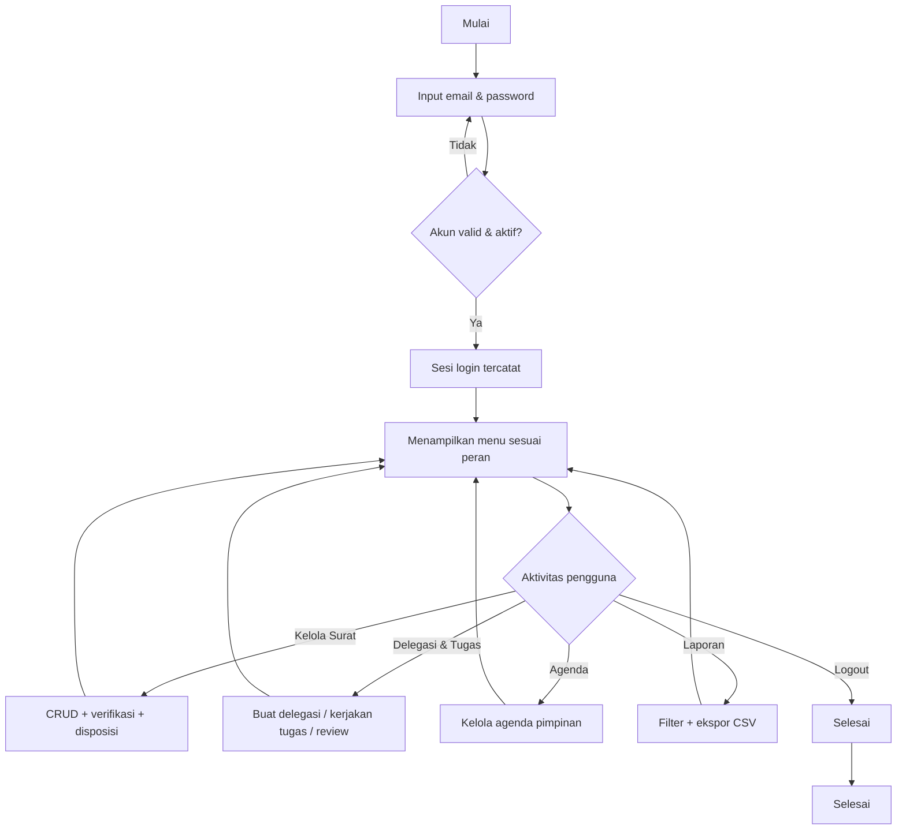
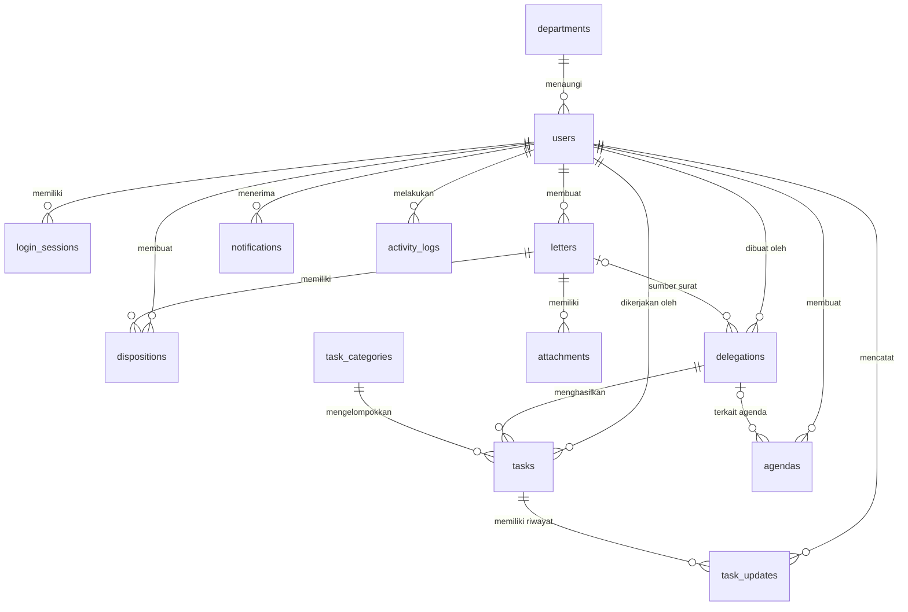

# LAPORAN PRAKTIK KERJA LAPANGAN (PKL)

## RANCANG BANGUN APLIKASI **E-DELEGASI**
### *Electronic Digital Delegation and Staff Task Information System* Berbasis Web

---

**Disusun oleh:**

Nama : \[NAMA SISWA\]

NIS / NISN : \[NIS / NISN\]

Kelas : \[KELAS\]

---

Konsentrasi Keahlian **Rekayasa Perangkat Lunak (RPL)**

**SMK NEGERI 1 PERCUT SEI TUAN**

**TAHUN PELAJARAN 2026/2027**

---

---

# LEMBAR PENGESAHAN SEKOLAH

Laporan Praktik Kerja Lapangan (PKL) dengan judul **"Rancang Bangun Aplikasi E-Delegasi (Electronic Digital Delegation and Staff Task Information System) Berbasis Web"** yang disusun oleh:

| | |
|---|---|
| Nama | : \[NAMA SISWA\] |
| NIS / NISN | : \[NIS / NISN\] |
| Kelas | : \[KELAS\] |
| Kompetensi Keahlian | : Rekayasa Perangkat Lunak (RPL) |

telah diperiksa dan disahkan sebagai laporan hasil pelaksanaan Praktik Kerja Lapangan di \[NAMA INDUSTRI/DUDI\].

| | |
|---|---|
| **Guru Pembimbing,** | **Ketua Kompetensi Keahlian RPL,** |
| | |
| | |
| \[NAMA GURU PEMBIMBING\] | \[NAMA KAPROLI\] |
| NIP. \[NIP\] | NIP. \[NIP\] |

Mengetahui,

| | |
|---|---|
| **Kepala SMK Negeri 1 Percut Sei Tuan,** | |
| | |
| | |
| \[NAMA KEPALA SEKOLAH\] | |
| NIP. \[NIP\] | |

---

# LEMBAR PENGESAHAN INDUSTRI / DUDI

Laporan Praktik Kerja Lapangan (PKL) yang berjudul **"Rancang Bangun Aplikasi E-Delegasi (Electronic Digital Delegation and Staff Task Information System) Berbasis Web"** telah diperiksa dan diterima sebagai bukti bahwa siswa SMK Negeri 1 Percut Sei Tuan telah melaksanakan PKL di tempat kami selama \[JUMLAH BULAN/HARI\] terhitung mulai \[TANGGAL MULAI\] sampai dengan \[TANGGAL SELESAI\].

| | |
|---|---|
| **Pembimbing Industri / DUDI,** | **Siswa,** |
| | |
| | |
| \[NAMA PEMBIMBING INDUSTRI\] | \[NAMA SISWA\] |
| Jabatan: \[JABATAN\] | NIS. \[NIS\] |

| |
|---|
| \[NAMA INDUSTRI/DUDI\] |
| \[ALAMAT INDUSTRI\] |

---

# KATA PENGANTAR

Puji dan syukur penulis panjatkan ke hadirat Tuhan Yang Maha Esa karena atas rahmat dan karunia-Nya penulis dapat menyelesaikan Laporan Praktik Kerja Lapangan (PKL) yang berjudul *"Rancang Bangun Aplikasi E-Delegasi (Electronic Digital Delegation and Staff Task Information System) Berbasis Web"* ini dengan baik.

Laporan ini disusun sebagai salah satu syarat penyelesaian Praktik Kerja Lapangan pada Konsentrasi Keahlian Rekayasa Perangkat Lunak (RPL) SMK Negeri 1 Percut Sei Tuan. Selama pelaksanaan PKL dan penyusunan laporan ini, penulis banyak memperoleh bimbingan, arahan, dan bantuan dari berbagai pihak. Oleh karena itu, pada kesempatan ini penulis menyampaikan terima kasih kepada:

1. Kepala SMK Negeri 1 Percut Sei Tuan, yang telah memberikan izin pelaksanaan PKL;
2. Ketua Kompetensi Keahlian Rekayasa Perangkat Lunak, yang telah memfasilitasi kegiatan PKL;
3. Guru pembimbing, yang telah membimbing serta memberikan arahan selama pelaksanaan PKL dan penyusunan laporan;
4. Pembimbing industri di \[NAMA INDUSTRI/DUDI\], yang telah memberikan bimbingan teknis di lapangan;
5. Keluarga dan rekan-rekan yang senantiasa memberikan dukungan dan motivasi.

Penulis menyadari bahwa laporan ini masih jauh dari sempurna. Oleh karena itu, kritik dan saran yang membangun sangat penulis harapkan demi perbaikan. Semoga laporan ini bermanfaat bagi pihak sekolah, industri, dan pembaca pada umumnya.

\[KOTA\], \[TANGGAL\]

Penulis,

\[NAMA SISWA\]

---

# DAFTAR ISI

*(Perbarui nomor halaman sesuai hasil penyusunan akhir.)*

| Bagian | Halaman |
|---|---|
| BAGIAN AWAL | |
| Sampul | i |
| Lembar Pengesahan Sekolah | ii |
| Lembar Pengesahan Industri/DUDI | iii |
| Kata Pengantar | iv |
| Daftar Isi | v |
| Daftar Gambar | vii |
| Daftar Tabel | viii |
| Daftar Lampiran | ix |
| BAB I PENDAHULUAN | 1 |
| 1.1 Latar Belakang | 1 |
| 1.2 Rumusan Masalah | 3 |
| 1.3 Tujuan PKL | 4 |
| 1.4 Manfaat | 4 |
| 1.5 Ruang Lingkup | 5 |
| BAB II GAMBARAN UMUM PERUSAHAAN | 6 |
| 2.1 Profil Perusahaan | 6 |
| 2.2 Struktur Organisasi | 7 |
| 2.3 Bidang Usaha | 8 |
| 2.4 Sistem Kerja | 8 |
| 2.5 Permasalahan yang Ditemukan | 9 |
| BAB III LANDASAN TEORI | 10 |
| 3.1 Sistem Informasi | 10 |
| 3.2 Database | 10 |
| 3.3 Multi User | 11 |
| 3.4 UML | 11 |
| 3.5 Flowchart | 12 |
| 3.6 ERD | 12 |
| 3.7 Normalisasi | 13 |
| 3.8 Bahasa Pemrograman | 13 |
| 3.9 Framework | 14 |
| 3.10 DBMS (MySQL) | 14 |
| 3.11 Pengujian Black Box | 15 |
| BAB IV ANALISIS DAN PERANCANGAN SISTEM | 16 |
| 4.1 Analisis Sistem Berjalan | 16 |
| 4.2 Analisis Kebutuhan | 18 |
| 4.3 Perancangan Sistem | 21 |
| BAB V IMPLEMENTASI DAN PENGUJIAN | 33 |
| 5.1 Implementasi | 33 |
| 5.2 Implementasi Database | 35 |
| 5.3 Implementasi Antarmuka | 39 |
| 5.4 Implementasi Hak Akses (Multi User) | 42 |
| 5.5 Pengujian Sistem | 44 |
| BAB VI PENUTUP | 50 |
| 6.1 Kesimpulan | 50 |
| 6.2 Saran | 51 |
| DAFTAR PUSTAKA | 52 |
| LAMPIRAN | 54 |

---

# DAFTAR GAMBAR

*(Daftar ini diperbarui setelah gambar-gambar (diagram & screenshot) dimasukkan. Nomor gambar dibuat otomatis setelah seluruh gambar disisipkan.)*

| No. Gambar | Judul | Halaman |
|---|---|---|
| Gambar 2.1 | Struktur Organisasi \[NAMA INDUSTRI\] | 7 |
| Gambar 4.1 | Flowchart Sistem Berjalan | 16 |
| Gambar 4.2 | Flowchart Sistem yang Diusulkan | 22 |
| Gambar 4.3 | Use Case Diagram | 24 |
| Gambar 4.4 | Activity Diagram Login | 26 |
| Gambar 4.5 | Activity Diagram Kelola Delegasi Tugas | 27 |
| Gambar 4.6 | Sequence Diagram Verifikasi Surat | 28 |
| Gambar 4.7 | Class Diagram | 29 |
| Gambar 4.8 | ERD (Entity Relationship Diagram) | 30 |
| Gambar 4.9 | Relasi Tabel Database | 31 |
| Gambar 4.10 | Rancangan Halaman Login | 32 |
| Gambar 5.1 | Halaman Login | 39 |
| Gambar 5.2 | Halaman Dashboard | 39 |
| Gambar 5.3 | Menu Master / Referensi | 40 |
| Gambar 5.4 | Menu Transaksi Surat | 40 |
| Gambar 5.5 | Menu Delegasi & Tugas | 41 |
| Gambar 5.6 | Menu Laporan | 41 |
| Gambar 5.7 | Menu Pengaturan | 42 |

---

# DAFTAR TABEL

| No. Tabel | Judul | Halaman |
|---|---|---|
| Tabel 4.1 | Analisis Sistem Berjalan (Identifikasi Kelemahan) | 17 |
| Tabel 4.2 | Kebutuhan Fungsional | 18 |
| Tabel 4.3 | Kebutuhan Non Fungsional | 20 |
| Tabel 4.4 | Aktor dan Peran (Multi User) | 23 |
| Tabel 4.5 | Struktur Tabel Database | 30 |
| Tabel 5.1 | Spesifikasi Komputer Pengembang | 34 |
| Tabel 5.2 | Struktur Tabel `users` | 35 |
| Tabel 5.3 | Struktur Tabel `letters` | 35 |
| Tabel 5.4 | Struktur Tabel `dispositions` | 36 |
| Tabel 5.5 | Struktur Tabel `delegations` | 36 |
| Tabel 5.6 | Struktur Tabel `tasks` | 37 |
| Tabel 5.7 | Struktur Tabel `task_updates` | 37 |
| Tabel 5.8 | Struktur Tabel `agendas` | 38 |
| Tabel 5.9 | Tabel Pendukung Lainnya | 38 |
| Tabel 5.10 | Hak Akses Pengguna (Multi User) | 42 |
| Tabel 5.11 | Hasil Pengujian Black Box — Autentikasi | 44 |
| Tabel 5.12 | Hasil Pengujian Black Box — CRUD & Transaksi | 45 |
| Tabel 5.13 | Hasil Pengujian Black Box — Delegasi & Tugas | 47 |
| Tabel 5.14 | Hasil Pengujian Black Box — Laporan & Hak Akses | 49 |

---

# DAFTAR LAMPIRAN

| No. Lampiran | Judul | Halaman |
|---|---|---|
| Lampiran 1 | Surat Permohonan PKL | 54 |
| Lampiran 2 | Surat Balasan Industri/DUDI | 55 |
| Lampiran 3 | Jurnal Harian PKL | 56 |
| Lampiran 4 | Absensi PKL | 60 |
| Lampiran 5 | Dokumentasi Kegiatan | 61 |
| Lampiran 6 | Source Code Aplikasi | 62 |
| Lampiran 7 | Struktur Database (SQL) | 63 |
| Lampiran 8 | Manual Book Pengguna | 64 |
| Lampiran 9 | Manual Instalasi | 70 |
| Lampiran 10 | Hasil Pengujian | 73 |
| Lampiran 11 | Screenshot Aplikasi | 74 |
| Lampiran 12 | Biodata Siswa | 75 |

---

---

# BAB I PENDAHULUAN

## 1.1 Latar Belakang

### 1.1.1 Profil Singkat Tempat PKL

Praktik Kerja Lapangan (PKL) dilaksanakan di **\[NAMA INDUSTRI/LEMBAGA DUDI\]** yang beralamat di **\[ALAMAT INDUSTRI\]**. Instansi tersebut bergerak di bidang **\[BIDANG USAHA\]** dan setiap harinya menjalankan kegiatan administrasi perkantoran, termasuk pengelolaan surat-menyurat, penindaklanjutan surat masuk, penugasan kerja kepada pegawai, serta penyusunan jadwal kegiatan pimpinan.

Dalam menjalankan kegiatan tersebut, instansi melibatkan banyak pegawai dengan tugas yang berbeda-beda, mulai dari bagian penerima surat, sekretaris/pimpinan, hingga pegawai pelaksana. Perbedaan peran dan tanggung jawab tersebut menuntut adanya pembagian hak akses yang jelas dalam setiap proses administrasi.

### 1.1.2 Permasalahan yang Ditemukan

Selama pelaksanaan PKL, ditemukan beberapa permasalahan pada proses administrasi yang sedang berjalan, di antaranya:

1. **Pengelolaan surat masih bersifat manual.** Pencatatan surat masuk dan surat keluar dilakukan pada buku agenda. Hal ini menyebabkan pendataan mudah rusak, sulit dicari kembali, dan berisiko duplikasi data.
2. **Belum ada penelusuran status surat secara real-time.** Setelah surat dibagikan/disposisikan, sulit mengetahui tahapan tindak lanjut surat tersebut (sudah dibaca, diproses, atau belum diproses).
3. **Penugasan/delegasi pekerjaan tidak terdokumentasi dengan baik.** Penugasan disampaikan secara lisan, sehingga tidak ada catatan deadline, prioritas, bukti pengerjaan, maupun riwayat pengerjaan. Akibatnya, pekerjaan sering terlambat tanpa ada pihak yang dapat dipantau.
4. **Tidak ada laporan yang tersusun otomatis.** Rekapitulasi surat, tugas, maupun agenda harus dihitung ulang secara manual dan membutuhkan waktu lama.

### 1.1.3 Pentingnya Pengembangan Aplikasi

Berdasarkan permasalahan tersebut, diperlukan sebuah **sistem informasi berbasis web dan database** yang dapat mengelola surat masuk, surat keluar, disposisi, delegasi tugas, agenda pimpinan, hingga laporan secara terpusat. Sistem ini perlu mendukung **multi-user** dengan pembagian hak akses sesuai peran, sehingga setiap proses dapat dipantau, dicatat, dan dipertanggungjawabkan.

Oleh karena itu, penulis mengembangkan aplikasi **E-DELEGASI: Electronic Digital Delegation and Staff Task Information System** — sebuah sistem informasi pengelolaan surat dan penugasan (delegasi) tugas staf yang dibangun menggunakan *framework* Laravel dan database MySQL. Aplikasi ini diharapkan mampu menggantikan pencatatan manual dengan proses digital yang terstruktur, aman, dan menghasilkan laporan secara otomatis.

## 1.2 Rumusan Masalah

Berdasarkan latar belakang di atas, rumusan masalah dalam pelaksanaan PKL ini adalah:

1. Bagaimana merancang aplikasi sistem informasi pengelolaan surat dan delegasi tugas yang sesuai dengan kebutuhan industri?
2. Bagaimana membangun aplikasi **multi-user berbasis database** yang mampu mengelola data surat masuk, surat keluar, disposisi, delegasi tugas, agenda pimpinan, dan laporan?
3. Bagaimana mengimplementasikan sistem **autentikasi (login/logout)** dan **hak akses** untuk setiap peran pengguna?
4. Bagaimana menguji aplikasi menggunakan **Black Box Testing** agar sesuai dengan kebutuhan fungsional yang ditetapkan?

## 1.3 Tujuan PKL

### 1.3.1 Tujuan Kegiatan PKL

1. Menerapkan kompetensi yang telah dipelajari di sekolah (Rekayasa Perangkat Lunak) ke dalam dunia kerja nyata.
2. Memperoleh pengalaman bekerja sesuai budaya kerja industri dan membangun karakter profesional.
3. Menghasilkan karya berupa aplikasi yang benar-benar dapat digunakan oleh industri.

### 1.3.2 Tujuan Pembangunan Aplikasi

1. Membangun aplikasi berbasis web **multi-user** dengan minimal dua level hak akses (Admin, Sekretaris, Staff).
2. Mendigitalisasi pengelolaan surat masuk/keluar, disposisi, delegasi tugas, agenda pimpinan, dan laporan dalam satu sistem terintegrasi berbasis database.
3. Melakukan pengujian sistem menggunakan metode **Black Box Testing** dan mendokumentasikan seluruh hasil pengujian.

## 1.4 Manfaat

### 1.4.1 Bagi Siswa

1. Memperoleh pengalaman langsung dalam menganalisis kebutuhan pengguna, merancang, membangun, dan menguji sistem informasi.
2. Meningkatkan keterampilan teknis pemrograman web (PHP, Laravel, MySQL, Blademka) serta kemampuan problem solving.
3. Melatih etika kerja, komunikasi, dan tanggung jawab dalam menyelesaikan pekerjaan nyata.

### 1.4.2 Bagi Sekolah

1. Menjalin kerja sama (link and match) antara sekolah dengan dunia industri.
2. Memperoleh masukan mengenai kebutuhan kompetensi siswa yang relevan dengan dunia kerja.
3. Memperkaya portofolio karya siswa Program Keahlian RPL.

### 1.4.3 Bagi Industri

1. Mendapatkan aplikasi sistem informasi yang dapat digunakan untuk mengelola surat dan penugasan secara terkomputerisasi.
2. Meningkatkan efisiensi administrasi karena data tersimpan rapi, mudah dicari, dan laporan tersusun otomatis.
3. Memperoleh tenaga kerja yang siap pakai serta gambaran hasil kerja siswa sebagai bahan evaluasi.

## 1.5 Ruang Lingkup

Agar pembahasan lebih terarah, ruang lingkup aplikasi E-Delegasi dibatasi sebagai berikut:

1. Aplikasi merupakan **sistem informasi berbasis web (browser)** yang dibangun menggunakan bahasa pemrograman **PHP**, *framework* **Laravel**, dan **DBMS MySQL**.
2. Pengguna aplikasi terdiri atas tiga peran: **Admin**, **Sekretaris**, dan **Staff**, masing-masing dengan hak akses yang berbeda.
3. Modul yang dibangun meliputi: autentikasi (login/logout), dashboard, surat masuk, surat keluar, disposisi dan verifikasi, delegasi tugas, pengerjaan dan review tugas, agenda pimpinan, arsip, galeri, laporan/ekspor, notifikasi, pengguna, referensi (master data), pengaturan, riwayat aktivitas, dan manajemen perangkat/sesi login.
4. Seluruh data disimpan pada **database MySQL** (bukan file Excel/teks) dan memiliki fitur pencarian, filter, serta laporan.
5. Pengujian dilakukan menggunakan **Black Box Testing** terhadap aspek fungsional; pengujian keamanan secara mendalam, instalasi pada server produksi, dan pengembangan aplikasi mobile berada di luar ruang lingkup laporan ini.

---

# BAB II GAMBARAN UMUM PERUSAHAAN

## 2.1 Profil Perusahaan

**\[NAMA INDUSTRI/DUDI\]** adalah **\[JENIS INSTANSI/LEMBAGA\]** yang berkedudukan di **\[ALAMAT LENGKAP\]**. Instansi ini berdiri sejak **\[TAHUN BERDIRI\]** dan saat ini memiliki **\[JUMLAH\]** pegawai.

>

> *(Isi dengan profil sebenarnya tempat PKL: nama, alamat, tahun berdiri, visi-misi, jumlah pegawai, layanan/kerjasama, dsb.)*

## 2.2 Struktur Organisasi

Struktur organisasi **\[NAMA INDUSTRI\]** disusun sesuai dengan bidang tugas masing-masing bagian. Gambaran struktur organisasi tempat PKL ditunjukkan pada Gambar 2.1.

 *(Sisipkan gambar struktur organisasi \[NAMA INDUSTRI\] di sini)*

**Gambar 2.1** Struktur Organisasi \[NAMA INDUSTRI\]

## 2.3 Bidang Usaha

**\[NAMA INDUSTRI\]** bergerak di bidang **\[BIDANG USAHA\]**. Aktivitas utamanya meliputi:

1. **\[Aktivitas utama 1\]**
2. **\[Aktivitas utama 2\]**
3. **\[Aktivitas utama 3\]**

Dalam bidang tersebut, kegiatan administrasi surat-menyurat dan penugasan kerja memegang peran penting untuk mendukung kelancaran operasional.

## 2.4 Sistem Kerja

Sistem kerja yang berjalan di **\[NAMA INDUSTRI\]** adalah sebagai berikut:

1. Setiap surat yang masuk diterima oleh bagian **\[BAGIAN PENERIMA\]**, kemudian dicatat dalam **buku agenda** secara manual.
2. Surat diteruskan kepada **\[PIMPINAN/SEKRETARIS\]** untuk ditindaklanjuti (disposisi) guna menentukan tindak lanjut.
3. Tindak lanjut berupa penugasan kepada pegawai disampaikan secara **lisan atau memo**.
4. Pelaksanaan pekerjaan dan bukti hasilnya tidak tercatat secara sistematis.
5. Pelaporan (rekap surat, tugas, agenda) dilakukan secara manual oleh bagian administrasi.

## 2.5 Permasalahan yang Ditemukan

Dari pengamatan selama PKL, ditemukan permasalahan utama pada sistem kerja tersebut:

1. **Pencatatan manual** menyebabkan data sulit dicari kembali dan rawan duplikasi/kehilangan.
2. **Tidak ada penelusuran status** surat dan penugasan secara real-time.
3. **Delegasi tugas tidak terdokumentasi**, sehingga deadline tidak dapat dipantau dan tidak ada riwayat pengerjaan.
4. **Pembuatan laporan memerlukan waktu lama** karena dilakukan manual.
5. **Kesalahan akibat kelalaian manusia** dalam input/hitung manual cukup tinggi.

---

# BAB III LANDASAN TEORI

## 3.1 Sistem Informasi

Sistem informasi adalah kombinasi terorganisasi antara manusia, perangkat keras, perangkat lunak, jaringan komunikasi, dan sumber daya data yang mengumpulkan, mengubah, dan menyebarkan informasi di dalam organisasi (O'Brien & Marakas, 2011). Dalam konteks aplikasi E-Delegasi, sistem informasi digunakan untuk mengubah pengelolaan surat dan tugas yang semula manual menjadi terkomputerisasi sehingga data lebih akurat, cepat, dan dapat dipertanggungjawabkan.

## 3.2 Database

Database adalah kumpulan data yang terintegrasi dan dikelola sedemikian rupa sehingga dapat digunakan kembali dengan mudah dan efisien (Connolly & Begg, 2015). Database menyimpan seluruh data aplikasi E-Delegasi, meliputi data pengguna, surat, disposisi, delegasi, tugas, agenda, notifikasi, dan log aktivitas. Penggunaan database relasional (MySQL) menjamin seluruh data tersimpan permanen, bebas dari ketergantungan file Excel/teks, serta dapat dihubungkan antar tabel melalui kunci (key).

## 3.3 Multi User

Sistem multi-user adalah sistem yang dapat digunakan oleh banyak pengguna sekaligus dengan hak akses berbeda-beda. Penerapan multi-user memerlukan mekanisme **autentikasi** (verifikasi identitas melalui login) dan **otorisasi** (pembatasan akses berdasarkan peran/role). Pada E-Delegasi, terdapat tiga peran pengguna, yaitu Admin, Sekretaris, dan Staff, yang masing-masing memiliki menu dan wewenang berbeda.

## 3.4 UML (Unified Modeling Language)

UML adalah standar bahasa pemodelan visual untuk memodelkan perangkat lunak berorientasi objek (Pressman & Maxim, 2020). Diagram UML yang digunakan dalam perancangan aplikasi ini antara lain:

- **Use Case Diagram** — menggambarkan interaksi antar aktor dan fungsi sistem.
- **Activity Diagram** — menggambarkan alur aktivitas suatu proses.
- **Sequence Diagram** — menggambarkan urutan interaksi antar objek terhadap waktu.
- **Class Diagram** — menggambarkan struktur kelas beserta hubungan antar kelas.

## 3.5 Flowchart

Flowchart (diagram alir) adalah representasi grafis dari langkah-langkah dan urutan prosedur suatu program/sistem (Shelly & Rosenblatt, 2012). Flowchart digunakan untuk menggambarkan alur proses lama (sistem berjalan) dan alur proses baru (sistem yang diusulkan), misalnya alur login dan alur pengelolaan surat masuk.

## 3.6 ERD (Entity Relationship Diagram)

ERD adalah model yang digunakan untuk menggambarkan hubungan antar entitas dalam basis data (Connolly & Begg, 2015). Entitas direpresentasikan sebagai tabel, atribut sebagai kolom, dan hubungan antar entitas dinyatakan dengan kardinalitas (one-to-one, one-to-many, many-to-many). ERD menjadi dasar perancangan struktur tabel pada database E-Delegasi.

## 3.7 Normalisasi

Normalisasi adalah proses pengelompokan data menjadi bentuk tabel-tabel normal untuk menghilangkan redundansi (pengulangan) data dan memastikan integritas data (Connolly & Begg, 2015). Tahapan normalisasi meliputi **1NF, 2NF, 3NF**, dst. Pada perancangan database E-Delegasi, seluruh tabel dirancang minimal sampai bentuk **normal ke-3 (3NF)** sehingga tidak ada duplikasi data dan setiap tabel hanya menyimpan data yang relevan.

## 3.8 Bahasa Pemrograman

Bahasa pemrograman yang digunakan adalah **PHP (Hypertext Preprocessor)**, bahasa pemrograman sisi server (*server-side*) untuk membangun aplikasi web dinamis (PHP Documentation, 2026). PHP memproses logika aplikasi di sisi server, berinteraksi dengan database, dan menghasilkan halaman HTML yang dikirim ke browser. Selain itu digunakan **HTML, CSS, dan JavaScript** untuk tampilan serta interaksi halaman.

## 3.9 Framework

*Framework* adalah kerangka kerja berupa kumpulan aturan, struktur, dan komponen terstandar yang mempercepat serta merapikan pengembangan aplikasi. Aplikasi E-Delegasi dibangun menggunakan **Laravel 9**, *framework* PHP berbasis pola **MVC (Model-View-Controller)** yang menyediakan fitur *routing*, *authentication*, *migration*, ORM *Eloquent*, validasi, dan *session* (Laravel Documentation, 2026). Untuk tampilan digunakan **Bootstrap 5** agar antarmuka responsif.

## 3.10 DBMS (MySQL)

DBMS (Database Management System) adalah perangkat lunak untuk mengelola database, termasuk pembuatan, pembaruan, dan pengambilan data. Aplikasi ini menggunakan **MySQL 8.0** sebagai DBMS relasional. MySQL mendukung SQL (*Structured Query Language*), indeks, relasi (foreign key), dan transaksi — sesuai kebutuhan aplikasi multi-user berbasis database.

## 3.11 Pengujian Black Box

Black Box Testing adalah pengujian yang berfokus pada kebutuhan fungsional sistem tanpa mengetahui struktur internal kode (Pressman & Maxim, 2020). Penguji hanya memeriksa **input** yang diberikan dan **output** yang dihasilkan sesuai dengan spesifikasi (hasil yang diharapkan). Hasil pengujian didokumentasikan dalam tabel: *Fitur, Skenario Pengujian, Hasil yang Diharapkan,* dan *Hasil Pengujian*.

---

# BAB IV ANALISIS DAN PERANCANGAN SISTEM

## 4.1 Analisis Sistem Berjalan

### 4.1.1 Flow Proses Lama

Proses pengelolaan surat dan penugasan yang sedang berjalan di **\[NAMA INDUSTRI\]** digambarkan pada Gambar 4.1.

 *(Sisipkan gambar flowchart sistem berjalan di sini)*

**Gambar 4.1** Flowchart Sistem Berjalan

Urutan proses sistem lama:

1. Penerimaan surat masuk dari pihak eksternal.
2. Pencatatan surat pada buku agenda secara manual oleh bagian administrasi.
3. Surat diserahkan kepada pimpinan/sekretaris untuk dibaca.
4. Pimpinan menentukan tindak lanjut dan menuliskan disposisi secara manual.
5. Penugasan pekerjaan disampaikan kepada pegawai secara lisan/memo.
6. Hasil pekerjaan tidak tercatat sistematis; pelaporan dilakukan manual.

### 4.1.2 Kelemahan Sistem Lama

Identifikasi kelemahan sistem lama ditunjukkan pada Tabel 4.1.

**Tabel 4.1** Analisis Sistem Berjalan (Identifikasi Kelemahan)

| No | Proses | Sistem Lama | Kelemahan |
|---|---|---|---|
| 1 | Pencatatan surat | Buku agenda manual | Data mudah hilang, sulit dicari, rawan duplikat |
| 2 | Disposisi | Catatan manual | Status tindak lanjut sulit ditelusuri |
| 3 | Penugasan pekerjaan | Lisan/memo | Tidak ada dokumentasi deadline & bukti kerja |
| 4 | Pelaporan | Rekap manual | Lama, rawan salah hitung |
| 5 | Pengguna | Tidak ada pembagian akses | Semua pegawai mengerjakan hal yang sama tanpa kontrol |

## 4.2 Analisis Kebutuhan

### 4.2.1 Kebutuhan Fungsional

Kebutuhan fungsional adalah layanan yang harus disediakan sistem. Kebutuhan fungsional E-Delegasi ditunjukkan pada Tabel 4.2.

**Tabel 4.2** Kebutuhan Fungsional

| Kode | Kebutuhan Fungsional | Deskripsi |
|---|---|---|
| F-01 | Login | Pengguna masuk menggunakan email dan kata sandi; sistem memvalidasi akun aktif |
| F-02 | Logout | Pengguna keluar dari sistem; sesi login diakhiri |
| F-03 | Kelola Surat Masuk | Tambah, ubah, hapus, cari, dan lihat surat masuk |
| F-04 | Verifikasi Surat Masuk | Sekretaris/Admin memverifikasi kelengkapan surat |
| F-05 | Kelola Surat Keluar | Tambah, ubah, hapus, cari, dan finalisasi surat keluar |
| F-06 | Disposisi Surat | Buat, ubah, verifikasi, dan cetak disposisi surat |
| F-07 | Delegasi Tugas | Buat draf delegasi, kirim (send) kepada staff, monitoring |
| F-08 | Kelola Tugas | Staff menerima/menolak tugas, memperbarui progres, unggah bukti |
| F-09 | Review Tugas | Admin/Sekretaris memverifikasi penyelesaian tugas |
| F-10 | Agenda Pimpinan | Tambah, ubah, selesaikan agenda; tampilan kalender |
| F-11 | Arsip & Galeri | Lihat arsip surat dengan filter + ekspor; galeri lampiran |
| F-12 | Laporan | Laporan delegasi, tugas, agenda; ekspor CSV |
| F-13 | Kelola Pengguna | Admin menambah/mengubah/menonaktifkan akun, reset kata sandi |
| F-14 | Kelola Referensi | Klasifikasi surat, status surat, departemen, kategori tugas |
| F-15 | Pengaturan Sistem | Konfigurasi nama aplikasi, institusi, bahasa, ukuran halaman |
| F-16 | Notifikasi | Notifikasi delegasi, tugas, deadline, agenda |
| F-17 | Riwayat Aktivitas | Pencatatan log aktivitas pengguna (modul audit) |
| F-18 | Manajemen Sesi/Perangkat | Lihat perangkat login aktif; logout satu/ semua perangkat |

### 4.2.2 Kebutuhan Non Fungsional

Kebutuhan non fungsional meliputi kebutuhan **hardware**, **software**, dan **jaringan**, seperti ditunjukkan pada Tabel 4.3.

**Tabel 4.3** Kebutuhan Non Fungsional

| No | Kategori | Spesifikasi |
|---|---|---|
| 1 | Hardware (Server) | Prosesor minimal Intel Core i3 / setara, RAM 4 GB, HDD/SSD 20 GB |
| 2 | Hardware (Klien) | Komputer/handphone dengan browser modern (Chrome, Edge, Firefox) |
| 3 | Software | OS Windows/Linux, PHP ≥ 8.0, Composer, Web Server (Apache/Nginx/Laragon) |
| 4 | Software Database | MySQL 8.0 / MariaDB |
| 5 | Software Editor | Visual Studio Code / editor teks lain |
| 6 | Jaringan | Jaringan LAN/internet antara klien dan server; HTTPS untuk produksi |
| 7 | Usability | Antarmuka responsif, bahasa Indonesia/Inggris, mudah dipahami |
| 8 | Security | Autentikasi, pembatasan hak akses per role, validasi input |
| 9 | Performance | Waktu muat halaman cepat; jumlah data per halaman dapat diatur |

## 4.3 Perancangan Sistem

### 4.3.1 Flowchart

Flowchart sistem yang diusulkan menggambarkan alur kerja aplikasi dari awal hingga akhir, misalnya alur login dan alur pengelolaan sampah. Alur utama aplikasi E-Delegasi:

 *(Sisipkan gambar flowchart sistem yang diusulkan di sini)*

**Gambar 4.2** Flowchart Sistem yang Diusulkan

### 4.3.2 Use Case Diagram

Aktor dalam aplikasi E-Delegasi dijelaskan pada Tabel 4.4.

**Tabel 4.4** Aktor dan Peran (Multi User)

| Aktor | Deskripsi | Hak Akses Utama |
|---|---|---|
| **Admin** | Mengelola sistem secara keseluruhan | Kelola pengguna, referensi, pengaturan, seluruh data surat/tugas, laporan |
| **Sekretaris** | Operator administrasi surat dan pengendali kerja | Kelola surat masuk, verifikasi, disposisi, delegasi, review tugas, agenda, laporan |
| **Staff** | Pelaksana tugas | Menerima/menolak tugas, memperbarui progres, unggah bukti, lihat agenda |

 *(Sisipkan gambar use case diagram di sini)*

**Gambar 4.3** Use Case Diagram

Daftar *use case* utama:

1. Login / Logout
2. Kelola Surat Masuk (CRUD)
3. Verifikasi Surat Masuk
4. Kelola Surat Keluar (CRUD + finalisasi)
5. Kelola Disposisi (CRUD + verifikasi + cetak)
6. Kelola Delegasi Tugas (buat, kirim, monitoring)
7. Kelola Tugas (terima/tolak, progres, unggah bukti)
8. Review Tugas
9. Kelola Agenda Pimpinan
10. Arsip & Galeri
11. Laporan & Ekspor
12. Kelola Pengguna (Admin)
13. Kelola Referensi / Master Data (Admin)
14. Pengaturan Sistem (Admin)
15. Melihat Notifikasi
16. Manajemen Perangkat/Sesi Login

### 4.3.3 Activity Diagram

Activity diagram menggambarkan alur aktivitas proses dalam sistem. Contoh activity diagram untuk proses **Login** (Gambar 4.4) dan **Kelola Delegasi Tugas** (Gambar 4.5).

 *(Sisipkan gambar activity diagram login di sini)*

**Gambar 4.4** Activity Diagram Login

**Alur Login:** Pengguna membuka halaman login → menginput email dan kata sandi → sistem memvalidasi → jika benar dan akun aktif, sesi login dibuat dan dashboard ditampilkan; jika salah, muncul pesan kesalahan dan kembali ke form login.

**Alur Kirim Delegasi (Gambar 4.5):** Sekretaris/Admin membuat delegasi (judul, keterangan, kategori, prioritas, deadline, staff, lampiran) → data disimpan sebagai draf → mengirim delegasi → sistem membuat task untuk setiap staff → sistem mengirim notifikasi → status delegasi menjadi "dikirim".

 *(Sisipkan gambar activity diagram delegasi di sini)*

**Gambar 4.5** Activity Diagram Kelola Delegasi Tugas

### 4.3.4 Sequence Diagram

Sequence diagram menggambarkan urutan interaksi antar objek terhadap waktu. Contoh sequence diagram untuk proses **Verifikasi Surat Masuk** dijelaskan pada Gambar 4.6.

 *(Sisipkan gambar sequence diagram di sini)*

**Gambar 4.6** Sequence Diagram Verifikasi Surat

**Urutan interaksi verifikasi surat:** Sekretaris membuka detail surat → sistem menampilkan data surat → sekretaris mengisi status verifikasi dan catatan → sistem menyimpan hasil verifikasi ke tabel `letters` → sistem mencatat aktivitas pada `activity_logs` → data status surat diperbarui di halaman daftar.

### 4.3.5 Class Diagram

Class diagram menggambarkan struktur kelas (Model) aplikasi. Model utama E-Delegasi antara lain: `User`, `Letter`, `Attachment`, `Disposition`, `Delegation`, `Task`, `TaskUpdate`, `Agenda`, `Notification`, `ActivityLog`, `Department`, `TaskCategory`, `LoginSession`, dan `Config`.

 *(Sisipkan gambar class diagram di sini)*

**Gambar 4.7** Class Diagram

Hubungan antar kelas (relasi):

- `User` 1—N `Letter`, `Disposition`, `Task`, `TaskUpdate`, `Agenda`, `Notification`, `ActivityLog`, `LoginSession`
- `Letter` 1—N `Attachment`, `Disposition`; 1—1 `Delegation` (optional sumber)
- `Delegation` 1—N `Task`, 1—N `Agenda` (optional)
- `Task` 1—N `TaskUpdate`
- `Department` 1—N `User`; `TaskCategory` 1—N `Task`

### 4.3.6 ERD (Entity Relationship Diagram)

ERD menjelaskan entitas dan hubungan antar entitas pada database E-Delegasi, digambarkan pada Gambar 4.8.

 *(Sisipkan gambar ERD di sini)*

**Gambar 4.8** ERD (Entity Relationship Diagram)

### 4.3.7 Relasi Tabel

Relasi tabel menggambarkan keterhubungan antar tabel melalui *primary key* dan *foreign key* (Gambar 4.9). Rincian relasi utama:

1. `letters.user_id` → `users.id`
2. `letters.classification_code` → `classifications.code`
3. `letters.verified_by` → `users.id`
4. `dispositions.letter_id` → `letters.id`
5. `dispositions.letter_status` → `letter_statuses.id`
6. `attachments.letter_id` → `letters.id`
7. `delegations.letter_id` → `letters.id`; `delegations.created_by` → `users.id`
8. `tasks.delegation_id` → `delegations.id`; `tasks.staff_id` → `users.id`
9. `tasks.task_category_id` → `task_categories.id`
10. `task_updates.task_id` → `tasks.id`; `task_updates.user_id` → `users.id`
11. `agendas.delegation_id` → `delegations.id`; `agendas.created_by` → `users.id`
12. `users.department_id` → `departments.id`
13. `notifications.user_id` → `users.id`

 *(Sisipkan gambar relasi tabel di sini)*

**Gambar 4.9** Relasi Tabel Database

### 4.3.8 Struktur Database

Struktur tabel utama database E-Delegasi ditunjukkan pada Tabel 4.5. (Struktur kolom lengkap setiap tabel dijelaskan pada sub-bab 5.2 dan file `surat.sql`.)

**Tabel 4.5** Struktur Tabel Database

| Tabel | PK (Primary Key) | FK (Foreign Key) | Fungsi |
|---|---|---|---|
| `users` | `id` | `department_id` → `departments.id` | Data pengguna |
| `login_sessions` | `id` | `user_id` → `users.id` | Sesi login & perangkat |
| `letters` | `id` | `user_id`, `verified_by` → `users.id`; `classification_code` → `classifications.code` | Data surat |
| `dispositions` | `id` | `letter_id` → `letters.id`; `letter_status` → `letter_statuses.id`; `user_id` | Disposisi surat |
| `attachments` | `id` | `letter_id` → `letters.id`; `user_id` | Lampiran surat |
| `delegations` | `id` | `letter_id` → `letters.id`; `created_by` | Delegasi tugas |
| `tasks` | `id` | `delegation_id` → `delegations.id`; `staff_id`, `created_by` → `users.id`; `task_category_id` → `task_categories.id` | Tugas dari delegasi |
| `task_updates` | `id` | `task_id` → `tasks.id`; `user_id` | Riwayat progres tugas |
| `agendas` | `id` | `delegation_id` → `delegations.id`; `letter_id` → `letters.id`; `created_by` → `users.id` | Agenda pimpinan |
| `notifications` | `id` | `user_id` → `users.id` | Notifikasi |
| `activity_logs` | `id` | `user_id` → `users.id` | Log aktivitas |
| `departments` | `id` | — | Master bagian/unit |
| `task_categories` | `id` | — | Master kategori tugas |
| `classifications` | `code` | — | Master klasifikasi surat |
| `letter_statuses` | `id` | — | Master sifat surat |
| `configs` | `id` | — | Konfigurasi sistem |

### 4.3.9 Desain Antarmuka

Desain antarmuka aplikasi dirancang mengikuti template **Sneat (Bootstrap 5)** dengan tata letak responsif. Rancangan awal halaman login ditunjukkan pada Gambar 4.10.

 *(Sisipkan gambar rancangan/desain antarmuka login di sini)*

**Gambar 4.10** Rancangan Halaman Login

Desain antarmuka yang dirancang meliputi:

1. Halaman **Login** — form email, kata sandi, dan tombol masuk.
2. Halaman **Dashboard** — kartu statistik (surat masuk/keluar/disposisi, pengguna online), grafik tren 7 hari, aktivitas terbaru, dan aksi cepat.
3. Halaman **Menu Master** — daftar referensi (klasifikasi, status surat, departemen, kategori tugas, pengguna).
4. Halaman **Menu Transaksi** — daftar surat masuk/keluar, detail surat + disposisi, delegasi, tugas (daftar & kanban), agenda.
5. Halaman **Menu Laporan** — filter + tabel + tombol ekspor CSV.
6. Halaman **Menu Pengaturan** — form konfigurasi sistem.

*(Desain rinci setiap halaman dapat dilampirkan pada Lampiran screenshot aplikasi.)*

---

# BAB V IMPLEMENTASI DAN PENGUJIAN

## 5.1 Implementasi

### 5.1.1 Bahasa Pemrograman dan Framework

Aplikasi E-Delegasi diimplementasikan dengan:

- **Bahasa pemrograman:** PHP 8.x (versi minimal 8.0, pengembangan menggunakan PHP 8.5).
- **Framework:** Laravel 9 (pola MVC), Blade Template Engine.
- **Frontend:** Bootstrap 5 (template Sneat), Boxicons, JavaScript; visualisasi 3D pada dashboard menggunakan Three.js.
- **Database:** MySQL 8.0 (DBMS relasional).

### 5.1.2 Struktur Aplikasi

Aplikasi disusun sesuai pola MVC Laravel:

- **Route** (routing) didefinisikan pada `routes/web.php`, dilengkapi middleware `auth`, `session.valid`, dan `role:admin,sekretaris`.
- **Controller** terletak pada `app/Http/Controllers`, antara lain `IncomingLetterController`, `OutgoingLetterController`, `DispositionController`, `DelegationController`, `TaskController`, `AgendaController`, `ReportController`, `LoginController`, `UserController`, dan `PageController`.
- **Model** terletak pada `app/Models`, menggunakan ORM Eloquent.
- **View** terletak pada `resources/views`, menggunakan komponen Blade (`components/letter-card.blade.php`, `layout/main.blade.php`, dsb.).

### 5.1.3 Spesifikasi Komputer

Spesifikasi komputer yang digunakan untuk membangun dan menjalankan aplikasi pada tahap pengembangan ditunjukkan pada Tabel 5.1.

**Tabel 5.1** Spesifikasi Komputer Pengembang

| Komponen | Spesifikasi |
|---|---|
| Sistem Operasi | Windows 11 |
| Prosesor | \[PROSESOR\] |
| RAM | \[JUMLAH\] GB |
| Penyimpanan | \[SSD/HDD\] |
| Web Server | Laragon (Apache) |
| PHP | 8.x |
| Database | MySQL 8.0 |
| Editor | Visual Studio Code |
| Browser | Google Chrome / Microsoft Edge |

## 5.2 Implementasi Database

Database aplikasi bernama **`surat`** dengan *character set* `utf8mb4`. Berikut struktur tabel utama beserta *primary key (PK)* dan *foreign key (FK)*-nya.

**Tabel 5.2** Struktur Tabel `users`

| Kolom | Tipe | Keterangan |
|---|---|---|
| `id` | BIGINT (PK) | Identitas pengguna |
| `name`, `email`, `password` | VARCHAR | Data akun |
| `role` | VARCHAR | Peran: `admin` / `sekretaris` / `staff` |
| `department_id` | FK → `departments.id` | Bagian/unit |
| `is_active` | BOOLEAN | Status akun aktif/nonaktif |
| `profile_picture` | VARCHAR | Foto profil |
| `session_version` | INT | Versi sesi untuk "logout semua perangkat" |
| `remember_token`, `created_at`, `updated_at` | — | Bawaan Laravel |

**Tabel 5.3** Struktur Tabel `letters`

| Kolom | Tipe | Keterangan |
|---|---|---|
| `id` | BIGINT (PK) | Identitas surat |
| `reference_number` | VARCHAR UNIQUE | Nomor surat (unik) |
| `agenda_number` | VARCHAR | Nomor agenda |
| `from`, `to` | VARCHAR | Pengirim/penerima |
| `letter_date`, `received_date` | DATE | Tanggal surat/diterima |
| `description`, `note` | TEXT | Perihal & keterangan |
| `type` | VARCHAR | `incoming` / `outgoing` |
| `status` | VARCHAR | `waiting_for_final_file` / `final` |
| `classification_code` | FK → `classifications.code` | Klasifikasi surat |
| `verification_status` | VARCHAR | `menunggu_verifikasi` / `terverifikasi` / dst. |
| `verification_note` | TEXT | Catatan verifikasi |
| `verified_by` | FK → `users.id` | Verifikator |
| `verified_at` | TIMESTAMP | Waktu verifikasi |
| `user_id` | FK → `users.id` | Pembuat data |

**Tabel 5.4** Struktur Tabel `dispositions`

| Kolom | Tipe | Keterangan |
|---|---|---|
| `id` | BIGINT (PK) | Identitas disposisi |
| `letter_id` | FK → `letters.id` | Surat terkait |
| `to` | VARCHAR | Tujuan disposisi |
| `content` | TEXT | Isi disposisi |
| `due_date` | DATE | Tenggat |
| `letter_status` | FK → `letter_statuses.id` | Sifat surat |
| `received_at` | TIMESTAMP | Waktu diterima tujuan |
| `note` | TEXT | Keterangan |
| `user_id` | FK → `users.id` | Pembuat |

**Tabel 5.5** Struktur Tabel `delegations`

| Kolom | Tipe | Keterangan |
|---|---|---|
| `id` | BIGINT (PK) | Identitas delegasi |
| `letter_id` | FK → `letters.id` (nullable) | Sumber surat |
| `title`, `description`, `instruction` | VARCHAR/TEXT | Informasi delegasi |
| `priority` | VARCHAR | `rendah`/`normal`/`tinggi`/`urgent` |
| `deadline` | DATETIME | Batas waktu |
| `status` | VARCHAR | `draft`/`dikirim`/`diterima`/`dalam_pengerjaan`/`menunggu_verifikasi`/`selesai`/`ditolak` |
| `attachment` | VARCHAR | Lampiran delegasi |
| `created_by` | FK → `users.id` | Pembuat |

**Tabel 5.6** Struktur Tabel `tasks`

| Kolom | Tipe | Keterangan |
|---|---|---|
| `id` | BIGINT (PK) | Identitas tugas |
| `delegation_id` | FK → `delegations.id` | Delegasi asal |
| `title`, `description` | VARCHAR/TEXT | Informasi tugas |
| `staff_id` | FK → `users.id` | Staff penerima |
| `created_by` | FK → `users.id` | Pembuat tugas |
| `priority`, `deadline` | VARCHAR/DATETIME | Prioritas & tenggat |
| `progress` | SMALLINT | 0–100% |
| `status` | VARCHAR | `baru`/`diterima`/`dalam_pengerjaan`/`menunggu_review`/`selesai`/`ditolak`/`terlambat` |
| `task_category_id` | FK → `task_categories.id` | Kategori tugas |
| `attachment`, `note`, `completed_at` | — | Bukti, catatan, waktu selesai |

**Tabel 5.7** Struktur Tabel `task_updates`

| Kolom | Tipe | Keterangan |
|---|---|---|
| `id` | BIGINT (PK) | Identitas pembaruan |
| `task_id` | FK → `tasks.id` | Tugas terkait |
| `user_id` | FK → `users.id` | Pengguna yang memperbarui |
| `progress` | SMALLINT | Progres saat pembaruan |
| `note` | TEXT | Catatan pengerjaan |
| `document` | VARCHAR | Dokumen hasil pekerjaan |

**Tabel 5.8** Struktur Tabel `agendas`

| Kolom | Tipe | Keterangan |
|---|---|---|
| `id` | BIGINT (PK) | Identitas agenda |
| `title`, `description` | VARCHAR/TEXT | Judul & keterangan |
| `agenda_type` | VARCHAR | `rapat`/`undangan`/`kunjungan`/`audiensi`/`pelatihan`/dll. |
| `date`, `start_time`, `end_time` | DATE/TIME | Waktu agenda |
| `location` | VARCHAR | Lokasi |
| `delegation_id` | FK → `delegations.id` (nullable) | Terkait delegasi |
| `letter_id` | FK → `letters.id` (nullable) | Terkait surat |
| `status` | VARCHAR | `terjadwal`/`selesai`/`dibatalkan` |
| `created_by` | FK → `users.id` | Pembuat |

**Tabel 5.9** Tabel Pendukung Lainnya

| Tabel | Kolom Kunci | Keterangan |
|---|---|---|
| `classifications` | `code` (PK), `name` | Klasifikasi surat |
| `letter_statuses` | `id` (PK), `name` | Sifat surat (Rahasia/Segera/Biasa) |
| `departments` | `id` (PK), `code`, `name` | Master bagian/unit |
| `task_categories` | `id` (PK), `name`, `color` | Master kategori tugas |
| `attachments` | `id` (PK), `letter_id` (FK), `path`, `filename`, `extension` | Lampiran surat |
| `notifications` | `id` (PK), `user_id` (FK), `type`, `title`, `is_read` | Notifikasi |
| `activity_logs` | `id` (PK), `user_id` (FK), `action`, `module` | Log aktivitas |
| `login_sessions` | `id` (PK), `user_id` (FK) | Sesi login & perangkat |
| `configs` | `id` (PK), `key`, `value` | Konfigurasi sistem |
| `password_resets`, `failed_jobs`, `personal_access_tokens` | — | Tabel bawaan Laravel |

> **Catatan:** File lengkap struktur database (SQL) dilampirkan pada **Lampiran 7**.

## 5.3 Implementasi Antarmuka

Implementasi antarmuka aplikasi disesuaikan dengan rancangan pada sub-bab 4.3.9. Contoh tampilan halaman ditunjukkan pada foto/jepretan layar berikut.

### 5.3.1 Halaman Login

 *(Sisipkan screenshot halaman login di sini)*

**Gambar 5.1** Halaman Login

Halaman login berisi form email dan kata sandi dengan validasi. Sistem menolak akun nonaktif dan mengarahkan ke halaman *blocked*.

### 5.3.2 Halaman Dashboard

 *(Sisipkan screenshot halaman dashboard di sini)*

**Gambar 5.2** Halaman Dashboard

Dashboard menampilkan kartu statistik surat masuk, surat keluar, disposisi, dan pengguna aktif, grafik transaksi 7 hari terakhir, aktivitas terbaru, aksi cepat, dan visualisasi 3D.

### 5.3.3 Menu Master

 *(Sisipkan screenshot menu master di sini)*

**Gambar 5.3** Menu Master / Referensi

Menu master berisi pengelolaan klasifikasi surat, sifat surat, departemen, kategori tugas, dan pengguna (khusus admin).

### 5.3.4 Menu Transaksi

 *(Sisipkan screenshot menu transaksi surat di sini)*

**Gambar 5.4** Menu Transaksi Surat

Menu transaksi berisi surat masuk (dengan verifikasi), surat keluar (dengan finalisasi), disposisi, delegasi, tugas, dan agenda pimpinan. Setiap daftar dilengkapi pencarian dan filter.

 *(Sisipkan screenshot menu delegasi/tugas di sini)*

**Gambar 5.5** Menu Delegasi & Tugas

### 5.3.5 Menu Laporan

 *(Sisipkan screenshot halaman laporan di sini)*

**Gambar 5.6** Menu Laporan

Menu laporan menampilkan laporan delegasi, tugas, dan agenda dengan filter (rentang tanggal, status, prioritas) beserta tombol **Ekspor CSV** berformat UTF-8 (BOM) agar aman dibuka di Excel.

### 5.3.6 Menu Pengaturan

 *(Sisipkan screenshot halaman pengaturan di sini)*

**Gambar 5.7** Menu Pengaturan

Menu pengaturan (khusus admin) berisi konfigurasi nama aplikasi, identitas institusi, alamat, telepon, email, kata sandi default, ukuran halaman, bahasa, dan PIC.

## 5.4 Implementasi Hak Akses (Multi User)

Implementasi multi-user dilakukan melalui:

1. **Autentikasi:** proses login dengan email dan kata sandi (`LoginController`), pencatatan sesi login pada tabel `login_sessions`, dan pendeteksian akun nonaktif.
2. **Otorisasi:** middleware Laravel — `auth`, `session.valid` (keabsahan perangkat sesi), dan `role:admin,sekretaris/staff` untuk membatasi akses menu. Pengecekan ganda juga dilakukan pada level controller.
3. **Tampilan menu dinamis:** menu yang tampil di sidebar disesuaikan dengan peran pengguna.

Rincian hak akses setiap peran ditunjukkan pada Tabel 5.10.

**Tabel 5.10** Hak Akses Pengguna (Multi User)

| Menu / Modul | Admin | Sekretaris | Staff |
|---|---|---|---|
| Login / Logout | ✓ | ✓ | ✓ |
| Dashboard | ✓ | ✓ | ✓ |
| Surat Masuk (CRUD) | ✓ | ✓ | ✓ (lihat) |
| Verifikasi Surat Masuk | ✓ | ✓ | ✗ |
| Surat Keluar (CRUD + final) | ✓ | ✓ | ✓ |
| Disposisi | ✓ | ✓ | ✗ |
| Verifikasi Disposisi | ✓ | ✓ | ✗ |
| Delegasi (buat/kirim/monitoring) | ✓ | ✓ | ✗ |
| Tugas (terima/tolak/progres/review) | Review: ✓ | Review: ✓ | Kerjakan: ✓ |
| Agenda Pimpinan | ✓ | ✓ | ✓ (lihat) |
| Arsip & Galeri | ✓ | ✓ | ✓ |
| Laporan & Ekspor | ✓ | ✓ | ✗ |
| Kelola Pengguna | ✓ | ✗ | ✗ |
| Kelola Referensi (Master) | ✓ | ✗ | ✗ |
| Pengaturan Sistem | ✓ | ✗ | ✗ |
| Riwayat Aktivitas | ✓ | ✗ | ✗ |
| Notifikasi | ✓ | ✓ | ✓ |
| Manajemen Perangkat/Sesi | ✓ | ✓ | ✓ |

**Keterangan:** ✓ = dapat mengakses; ✗ = tidak dapat mengakses (dibatasi).

## 5.5 Pengujian Sistem

Pengujian dilakukan menggunakan metode **Black Box Testing**, yaitu menguji setiap fitur berdasarkan input dan hasil yang diharapkan tanpa melihat struktur kode. Pengujian dilakukan oleh siswa dan pihak pembimbing industri dengan hasil **\[SESUAI / TIDAK SESUAI\]** per skenario.

### 5.5.1 Pengujian Autentikasi

**Tabel 5.11** Hasil Pengujian Black Box — Autentikasi

| Fitur | Skenario Pengujian | Hasil yang Diharapkan | Hasil Pengujian |
|---|---|---|---|
| Login | Memasukkan email & password benar akun aktif | Berhasil masuk ke dashboard, sesi tercatat | \[SESUAI\] |
| Login | Memasukkan password salah | Muncul pesan kesalahan, tidak masuk | \[SESUAI\] |
| Login | Memasukkan email tidak terdaftar | Muncul pesan "akun tidak ditemukan" | \[SESUAI\] |
| Login | Login dengan akun nonaktif | Diarahkan ke halaman *blocked* | \[SESUAI\] |
| Login | Login tanpa mengisi form | Validasi menolak, muncul peringatan | \[SESUAI\] |
| Logout | Mengklik tombol logout | Keluar sistem, sesi dihapus, kembali ke login | \[SESUAI\] |
| Perangkat | Membuka perangkat login aktif | Daftar sesi tampil; bisa logout per/semua perangkat | \[SESUAI\] |

### 5.5.2 Pengujian CRUD & Transaksi

**Tabel 5.12** Hasil Pengujian Black Box — CRUD & Transaksi

| Fitur | Skenario Pengujian | Hasil yang Diharapkan | Hasil Pengujian |
|---|---|---|---|
| Surat Masuk | Menambah data surat lengkap | Data tersimpan, status "menunggu verifikasi" | \[SESUAI\] |
| Surat Masuk | Menambah surat tanpa nomor/klasifikasi | Validasi menolak penyimpanan | \[SESUAI\] |
| Surat Masuk | Mengubah & menghapus surat | Data berubah/terhapus beserta lampiran | \[SESUAI\] |
| Surat Masuk | Mencari surat per perihal/nomor | Hasil pencarian sesuai kata kunci | \[SESUAI\] |
| Verifikasi | Memverifikasi surat lengkap | Status menjadi "terverifikasi" + catatan tersimpan | \[SESUAI\] |
| Verifikasi | Verifikasi oleh staff | Ditolak (rol tidak berwenang) | \[SESUAI\] |
| Surat Keluar | Menambah surat keluar + upload lampiran | Tersimpan, status "waiting_for_final_file" | \[SESUAI\] |
| Finalisasi | Klik "Mark as Final" saat lampiran ada | Status menjadi "final" | \[SESUAI\] |
| Disposisi | Membuat disposisi lengkap | Disposisi tersimpan, lembar cetak tampil | \[SESUAI\] |
| Disposisi | Verifikasi disposisi oleh sekretaris | Status disposisi diperbarui | \[SESUAI\] |
| Arsip | Filter arsip per jenis & rentang tanggal | Data sesuai filter; ekspor CSV berhasil | \[SESUAI\] |
| Galeri | Membuka galeri surat masuk/keluar | Kartu lampiran tampil, PDF/gambar bisa dibuka | \[SESUAI\] |

### 5.5.3 Pengujian Delegasi & Tugas

**Tabel 5.13** Hasil Pengujian Black Box — Delegasi & Tugas

| Fitur | Skenario Pengujian | Hasil yang Diharapkan | Hasil Pengujian |
|---|---|---|---|
| Delegasi | Membuat delegasi sebagai draf | Draf tersimpan dengan status "draft" | \[SESUAI\] |
| Delegasi | Mengirim delegasi kepada staff | Task dibuat untuk tiap staff + notifikasi | \[SESUAI\] |
| Delegasi | Monitoring status delegasi | Status mengikuti status task (aktif/selesai/terlambat) | \[SESUAI\] |
| Tugas | Staff menerima tugas | Status tugas "diterima" | \[SESUAI\] |
| Tugas | Staff menolak tugas + alasan | Status "ditolak", alasan tersimpan | \[SESUAI\] |
| Tugas | Memperbarui progres + unggah bukti | Progres & dokumen tersimpan di riwayat | \[SESUAI\] |
| Tugas | Progres 100% → ajukan review | Status "menunggu_review" | \[SESUAI\] |
| Review | Admin/sekretaris verifikasi tugas selesai | Status "selesai", staff mendapat notifikasi | \[SESUAI\] |
| Review | Tugas tidak memenuhi syarat | Dikembalikan untuk dikerjakan ulang | \[SESUAI\] |
| Deadline | Tugas melewati tenggat | Status menjadi "terlambat" | \[SESUAI\] |
| Agenda | Menambah agenda + tautan delegasi | Agenda tampil di kalender | \[SESUAI\] |
| Agenda | Menandai agenda selesai | Status agenda "selesai" | \[SESUAI\] |

### 5.5.4 Pengujian Laporan & Hak Akses

**Tabel 5.14** Hasil Pengujian Black Box — Laporan & Hak Akses

| Fitur | Skenario Pengujian | Hasil yang Diharapkan | Hasil Pengujian |
|---|---|---|---|
| Laporan | Membuka laporan delegasi/tugas/agenda | Tabel laporan tampil sesuai filter | \[SESUAI\] |
| Laporan | Mengekspor laporan CSV | File CSV terunduh, terbuka di Excel (UTF-8 BOM) | \[SESUAI\] |
| Hak Akses | Staff mengakses menu laporan/pengguna | Ditolak / menu tidak tampil | \[SESUAI\] |
| Hak Akses | Staff mencoba verifikasi surat/tugas | Ditolak (middleware role) | \[SESUAI\] |
| Admin | Menambah/menonaktifkan pengguna | Akun tersimpan/nonaktif, login pengguna terblokir | \[SESUAI\] |
| Admin | Ubah pengaturan sistem & referensi | Konfigurasi berubah, tampilan aplikasi mengikuti | \[SESUAI\] |
| Notifikasi | Kejadian penting (delegasi, deadline, selesai) | Notifikasi masuk dan dapat ditandai dibaca | \[SESUAI\] |
| Riwayat | Membuka riwayat aktivitas | Log aktivitas tercatat sesuai aksi | \[SESUAI\] |
| 404 | Membuka alamat telah dihapus/tidak ada | Tampil halaman 404 "Halaman Tidak Ditemukan" | \[SESUAI\] |

Rekapitulasi hasil pengujian: **\[JUMLAH\] skenario diuji**, **\[JUMLAH\] sesuai**, **\[JUMLAH\] tidak sesuai**. *(Lengkapi rincian hasil pengujian pada Lampiran 10.)*

---

# BAB VI PENUTUP

## 6.1 Kesimpulan

Berdasarkan hasil analisis, perancangan, implementasi, dan pengujian aplikasi E-Delegasi, dapat disimpulkan:

1. Aplikasi **E-Delegasi (Electronic Digital Delegation and Staff Task Information System)** berhasil dirancang sesuai kebutuhan industri dalam mengelola surat masuk, surat keluar, disposisi, delegasi tugas, agenda pimpinan, dan laporan secara digital.
2. Aplikasi dibangun sebagai sistem **multi-user berbasis database** menggunakan bahasa pemrograman PHP, framework **Laravel 9**, dan **DBMS MySQL**. Seluruh data tersimpan pada database, bukan file Excel/teks, dan dirancang sampai bentuk normal 3NF sehingga meminimalkan redundansi data.
3. Sistem **autentikasi (login/logout)** dan **hak akses** berdasarkan peran (**Admin, Sekretaris, Staff**) telah diimplementasikan melalui middleware Laravel, sehingga setiap pengguna hanya dapat mengakses menu sesuai kewenangannya.
4. Aplikasi memiliki fitur **CRUD** pada seluruh modul, **pencarian & filter**, **laporan/ekspor CSV**, serta **dashboard** ringkasan informasi, sesuai ketentuan luaran PKL RPL.
5. Aplikasi memenuhi seluruh indikator ketentuan luaran PKL: berbasis database relasional, mendukung minimal dua level hak akses, memiliki autentikasi, data tersimpan di database, fitur CRUD, pencarian/filter/laporan, dashboard, validasi input, penanganan kesalahan, dokumentasi (*manual book* dan *manual instalasi*), *source code* beserta file `.sql`, serta pengujian **Black Box Testing**.
6. Hasil pengujian Black Box menunjukkan seluruh skenario pengujian berjalan **sesuai** dengan hasil yang diharapkan, sehingga aplikasi layak digunakan.

## 6.2 Saran

Berdasarkan hasil pelaksanaan PKL dan pengembangan aplikasi, penulis memberikan beberapa saran:

1. **Bagi industri:** dapat menggunakan aplikasi E-Delegasi secara langsung untuk mendigitalisasi administrasi surat dan penugasan, serta menempatkannya pada server produksi dengan koneksi **HTTPS** agar aman diakses secara luas.
2. **Pencadangan data (backup):** lakukan backup database dan folder penyimpanan lampiran secara berkala untuk menjaga keamanan data.
3. **Pengembangan lanjutan:** aplikasi dapat dikembangkan dengan fitur **PWA/notifikasi email**, integrasi kalender eksternal (Google Calendar), modul tanda tangan digital, dan pengembangan berbasis aplikasi mobile.
4. **Bagi siswa berikutnya:** dapat melanjutkan pengembangan sistem serupa dengan pendekatan metodologi pengembangan yang lebih detail, serta memperbanyak dokumentasi pengujian (termasuk pengujian keamanan dan *performance testing*).
5. **Bagi sekolah:** perlu terus menjalin kerja sama dengan dunia industri agar kompetensi siswa semakin sesuai kebutuhan dunia kerja.

---

# DAFTAR PUSTAKA

*(Format APA Style edisi ke-7 — sesuaikan sumber rujukan yang benar-benar digunakan.)*

Bootstrap. (2026). *Bootstrap 5 documentation*. https://getbootstrap.com/docs/5.0/

Connolly, T. M., & Begg, C. E. (2015). *Database systems: A practical approach to design, implementation, and management* (6th ed.). Pearson Education.

Jogiyanto, H. M. (2005). *Analisis dan desain sistem informasi: Pendekatan terstruktur teori dan praktik aplikasi bisnis*. Penerbit Andi.

Kendall, K. E., & Kendall, J. E. (2011). *Systems analysis and design* (8th ed.). Pearson Education.

Laravel. (2026). *Laravel 9.x documentation*. https://laravel.com/docs/9.x

MySQL. (2026). *MySQL 8.0 reference manual*. https://dev.mysql.com/doc/refman/8.0/en/

O'Brien, J. A., & Marakas, G. M. (2011). *Management information systems* (10th ed.). McGraw-Hill/Irwin.

PHP. (2026). *PHP manual*. https://www.php.net/docs.php

Pressman, R. S., & Maxim, B. R. (2020). *Software engineering: A practitioner's approach* (9th ed.). McGraw-Hill Education.

Rosa, A. S., & Shalahuddin, M. (2018). *Rekayasa perangkat lunak terstruktur dan berorientasi objek*. Penerbit Modula.

Shelly, G. B., & Rosenblatt, H. J. (2012). *Systems analysis and design* (9th ed.). Course Technology.

---

# LAMPIRAN

*(Lengkapi seluruh lampiran berikut sebagai bukti pelaksanaan PKL dan pengembangan aplikasi.)*

**Lampiran 1 — Surat PKL**

Surat permohonan PKL dari SMK Negeri 1 Percut Sei Tuan kepada \[NAMA INDUSTRI\].

**Lampiran 2 — Surat Balasan Industri**

Surat balasan/penerimaan PKL dari \[NAMA INDUSTRI\] untuk siswa peserta PKL.

**Lampiran 3 — Jurnal Harian PKL**

| Tanggal | Kegiatan | Paraf Pembimbing |
|---|---|---|
| \[TANGGAL\] | \[KEGIATAN\] | \[✓\] |
| \[TANGGAL\] | \[KEGIATAN\] | \[✓\] |

*(Lengkapi sesuai jurnal harian selama masa PKL, mencakup kegiatan analisis, perancangan, pemrograman, dan pengujian.)*

**Lampiran 4 — Absensi PKL**

Daftar hadir harian selama masa PKL di \[NAMA INDUSTRI\].

**Lampiran 5 — Dokumentasi Kegiatan**

Dokumentasi (foto) kegiatan PKL di \[NAMA INDUSTRI\].

**Lampiran 6 — Source Code Aplikasi**

Proyek aplikasi E-Delegasi (folder proyek Laravel) diserahkan lengkap dengan struktur `app/`, `routes/`, `database/migrations/`, `resources/views/`.

**Lampiran 7 — Struktur Database (SQL)**

File `surat.sql` — dump database `surat` (tabel, kolom, primary key, foreign key, dan data awal).

**Lampiran 8 — Manual Book Pengguna**

Panduan penggunaan aplikasi:

1. Login (akun dibuat admin).
2. Mengelola surat masuk & verifikasi.
3. Membuat disposisi dan mencetak lembar disposisi.
4. Membuat & mengirim delegasi, monitoring delegasi.
5. Mengerjakan tugas (terima, progres, unggah bukti, ajukan review).
6. Melakukan review/verifikasi penyelesaian tugas.
7. Mengelola agenda pimpinan.
8. Melihat arsip, galeri, dan mengekspor laporan.
9. Mengelola pengguna, referensi, dan pengaturan (admin).
10. Mengelola notifikasi dan perangkat login.

**Lampiran 9 — Manual Instalasi**

Langkah instalasi (ringkas):

1. Pastikan **PHP ≥ 8.0**, **Composer**, dan **MySQL** terpasang (disarankan Laragon).
2. Salin folder proyek ke web server, mis. `C:\laragon\www\laravel-surat`.
3. Buat database baru, mis. `surat` (utf8mb4).
4. Salin `.env.example` menjadi `.env`; atur koneksi database (`DB_DATABASE`, `DB_USERNAME`, `DB_PASSWORD`).
5. Jalankan `php artisan key:generate`.
6. Jalankan `php artisan migrate` (atau impor file `surat.sql`).
7. Jalankan `php artisan serve` atau buka via virtual host Laragon, lalu buka aplikasi di browser.
8. Login dengan akun yang telah disediakan/dibuat admin.

**Lampiran 10 — Hasil Pengujian**

Tabel hasil pengujian Black Box lengkap (lihat Tabel 5.11–5.14) beserta bukti pelaksanaan pengujian.

**Lampiran 11 — Screenshot Aplikasi**

Kumpulan screenshot seluruh halaman aplikasi (login, dashboard, master, transaksi, laporan, pengaturan).

**Lampiran 12 — Biodata Siswa**

| Item | Data |
|---|---|
| Nama | \[NAMA SISWA\] |
| NIS/NISN | \[NIS / NISN\] |
| Tempat, Tanggal Lahir | \[TTL\] |
| Kelas | \[KELAS\] |
| Kompetensi Keahlian | Rekayasa Perangkat Lunak |
| Alamat | \[ALAMAT\] |
| No. Telepon | \[NO. HP\] |
| Email | \[EMAIL\] |
| Tempat PKL | \[NAMA INDUSTRI\] |
| Periode PKL | \[TANGGAL MULAI\] s.d. \[TANGGAL SELESAI\] |
| Judul Laporan | Rancang Bangun Aplikasi E-Delegasi |
| Tahun Pelajaran | 2026/2027 |

---

*— Akhir Laporan —*